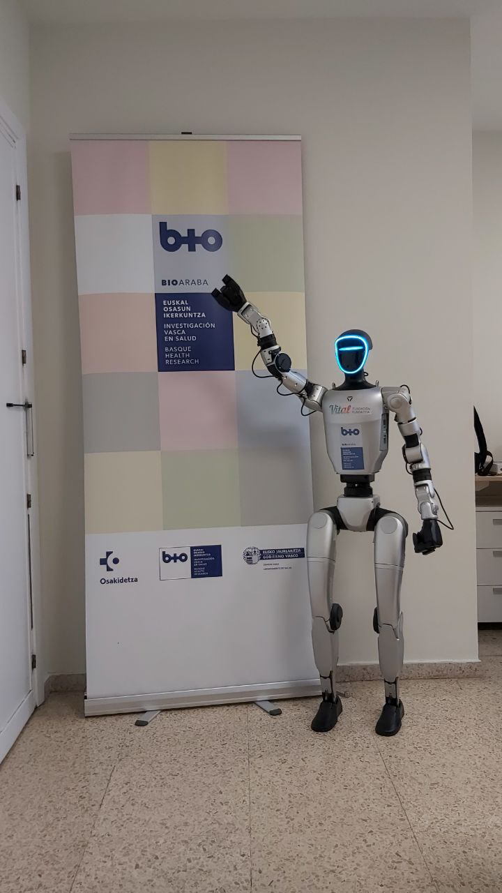

# 🤖 IIS BIOARABA - UAI - UNITREE G1 EDU U3

> **Plataforma de desarrollo e investigación con robot humanoide Unitree G1 EDU U3**  

## 📚 Documentación

- [🏠 Wiki](/wiki/_InicioWiki_.md)

## 🔗 Repositorios conectados

- [🔗 EncuestasSaaki - Github](https://github.com/andoni92/EncuestasSaaki)

## 👥 Equipo del Proyecto
<!-- [TODO] Revisar -->
- **Juan Fernández**  
  🎯 *Coordinador de la Plataforma de Innovación del IIS BIOARABA*  
  📧 [IIS BIOARABA - Innovación](https://www.bioaraba.org/plataformas-de-apoyo/plataforma-innovacion/)  
  🔬 *Responsable de dirección técnica y coordinación institucional*

- **Andoni González**  
  🎓 *Alumno en prácticas y TFG*  
  📚 *Grado en Ingeniería Informática de Gestión y Sistemas de Información*  
  🏫 [Universidad del País Vasco UPV/EHU](https://www.ehu.eus/es/web/graduak/grado-ingenieria-informatica-de-gestion-y-sistemas-de-informacion-alava)  
  💻 *Desarrollo técnico y documentación*

<!-- [TODO] Revisar y definir los objetivos del proyecto -->

## 🎯 Objetivos del Proyecto

- 🔬 **Investigación** en robótica humanoides aplicada a salud
- 🎓 **Formación** de estudiantes en tecnologías robóticas avanzadas  
- 💡 **Innovación** en control y programación de robots humanoides
- 🤝 **Colaboración** interinstitucional en proyectos tecnológicos

## 📅 Cronograma del Proyecto
<!-- [PENDIENTE] Rehacer completa, solo ejemplo, revisar fechas -->

| #   | Fase                                  | Actividad                                           | Fecha Inicio | Fecha Fin  | Estado        | Progreso        |
| --- | ------------------------------------- | --------------------------------------------------- | ------------ | ---------- | ------------  | --------------- |
| 1.  | **Android Studio**                    | Configuración de Android Studio en Windows 11       | 17/09/2025   | 19/09/2025 | ✅ Completado | 🟩🟩🟩🟩🟩 100% |
| 2.  | **APP**                               | APP para recogida de 2 encuestas                    | 19/09/2025   | 01/01/2026 | 🔄 En curso   | 🟨🟨🟨🟨⬜ 95%  |
| 3.  | **PYTHON**                            | Instalacion de Miniconda para Python                | 17/09/2025   | 17/09/2025 | ✅ Completado | 🟩🟩🟩🟩🟩 100% |
| 4.  | **WSL**                               | Configuración de WSL en Windows 11 (NO NOS VALE)    | 16/10/2025   | 07/11/2025 | ✅ Completado | 🟩🟩🟩🟩🟩 100% |
| 5.  | **UBUNTU**                            | Configuración Ubuntu con dualboot Windows 11        | 07/11/2025   | 07/11/2025 | ✅ Completado | 🟩🟩🟩🟩🟩 100% |
| 6.  | **WIKI**                              | Generacion de wiki y repositorios en Github privado | 11/11/2025   | 01/07/2026 | 🔄 En curso   | 🟨🟨🟨⬜⬜ 50%  |
| 7.  | **REAJUSTES**                         | Reinstalacion de miniconda, python y Android Studio | 12/11/2025   | 14/11/2025 | ✅ Completado | 🟩🟩🟩🟩🟩 100% |
| 8.  | **ROS2**                              | Instalacion y pruebas                               | 20/11/2025   | 21/11/2025 | ✅ Completado | 🟩🟩🟩🟩🟩 100% |
| 9.  | **ISAACSIM**                          | Instalacion de Isaac SIM                            | 21/11/2025   | 26/11/2025 | ✅ Completado | 🟩🟩🟩🟩🟩 100% |
| 10. | **ISAACLAB**                          | Instalacion de Isaac LAB                            | 26/11/2025   | 28/11/2025 | ✅ Completado | 🟩🟩🟩🟩🟩 100% |
| 11. | **Aprender Isaac Sim/Lab**            | Aprender a usar Isaac Sim/Lab y a aplicarlo al G1   | 03/12/2025   | 01/07/2026 | 🔄 En curso   | 🟨🟨⬜⬜⬜ 20%  |
| 12. | **Investigar repositorios Unitree**   | Investigar y usar repos de Unitree (sdk, ROS2...)   | 03/12/2025   | 01/07/2026 | 🔄 En curso   | 🟨🟨⬜⬜⬜ 20%  |
| 13. | **Conexión G1**                       | Lograr conectarnos sin errores al robot             | 18/12/2025   | 19/12/2025 | ⏳ Pendiente  | 🟥⬜⬜⬜⬜ 0%   |
| 14. | **LEDs en la cara**                   | Cambio del color de los LEDs                        | 19/12/2025   | 26/12/2025 | ⏳ Pendiente  | 🟥⬜⬜⬜⬜ 0%   |
| 15. | **Sonido**                            | Reproducir sonido                                   | 26/12/2025   | 30/01/2026 | ⏳ Pendiente  | 🟥⬜⬜⬜⬜ 0%   |
| 16. | **Movimiento programado**             | Movimiento de partes                                | 30/01/2026   | 13/02/2026 | ⏳ Pendiente  | 🟥⬜⬜⬜⬜ 0%   |
| 17. | **Movimiento fino**                   | Mover dedos de manos                                | 13/02/2026   | 13/03/2026 | ⏳ Pendiente  | 🟥⬜⬜⬜⬜ 0%   |
| 18. | **Visión por color**                  | Reconocimiento de colores                           | 13/03/2026   | 17/04/2026 | ⏳ Pendiente  | 🟥⬜⬜⬜⬜ 0%   |
| 19. | **Visión por forma**                  | Reconocimiento de formas                            | 17/04/2026   | 29/05/2026 | ⏳ Pendiente  | 🟥⬜⬜⬜⬜ 0%   |
| 20. | **Manipulación**                      | Coger objeto según forma y color                    | 29/05/2026   | 13/06/2026 | ⏳ Pendiente  | 🟥⬜⬜⬜⬜ 0%   |
| 21. | **Percepción avanzada**               | Reconocer objetos                                   | 13/06/2026   | 01/07/2026 | ⏳ Pendiente  | 🟥⬜⬜⬜⬜ 0%   |
| 22. | **Reconocimiento por voz**            |                                                     |              |            | 🔮 Futuro     |                 |
| 23. | **Respuesta a instrucciones por voz** |                                                     |              |            | 🔮 Futuro     |                 |
| 24. | **Navegación en interiores**          |                                                     |              |            | 🔮 Futuro     |                 |
| 25. | **Programación del mando**            |                                                     |              |            | 🔮 Futuro     |                 |
| 26. | **Movimientos quirúrgicos**           |                                                     |              |            | 🔮 Futuro     |                 |
