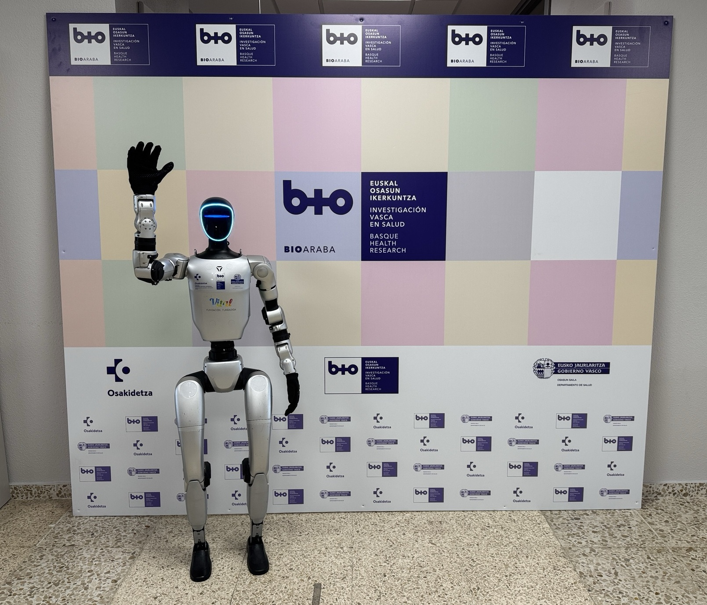

# 🤖 IIS BIOARABA - UAI - UNITREE G1 EDU U3

## **Plataforma de desarrollo e investigación con robótica humanoide**  

> Robot humanoide Unitree G1 EDU U3, alias **Saaki**

## 📚 Documentación

- [🏠 Wiki](/wiki/_InicioWiki_.md)

## 🔗 Repositorios conectados

- [🔗 saaki-core - Github](https://github.com/UAI-BIOARABA/saaki-core)
- [🔗 saaki-audios - Github](https://github.com/UAI-BIOARABA/saaki-audios)
- [🔗 saaki-app-encuestas - Github](https://github.com/UAI-BIOARABA/saaki-app-encuestas)

## 👥 Equipo del Proyecto

- **Juan Fernández**  
  🎯 *Coordinador de la Plataforma de Innovación del IIS BIOARABA*  
  📧 [IIS BIOARABA - Innovación](https://www.bioaraba.org/plataformas-de-apoyo/plataforma-innovacion/)  
  🔬 *Responsable de dirección técnica y coordinación institucional*

- **Andoni González**  
  🎓 *Alumno en prácticas y TFG*  
  📚 *Grado en Ingeniería Informática de Gestión y Sistemas de Información*  
  🏫 [Universidad del País Vasco UPV/EHU](https://www.ehu.eus/es/web/graduak/grado-ingenieria-informatica-de-gestion-y-sistemas-de-informacion-alava)  
  💻 *Desarrollo técnico y documentación*

## 🎯 Objetivos del Proyecto

- 🔬 **Investigación** en IA y robótica humanoide aplicada a salud
- 🎓 **Formación** de estudiantes en tecnologías robóticas avanzadas  
- 💡 **Innovación** en control y programación de robots humanoides
- 🤝 **Colaboración** interinstitucional en proyectos tecnológicos
- 🤖 **Saaki** convertir a Saaki en una plataforma multiproyecto y de investigación

## 📅 Cronograma del Proyecto
<!-- Ir reajustando fechas, fases y objetivos -->

| #   | Fase                                  | Actividad                                           | Fecha Inicio | Fecha Fin  | Estado        | Progreso      |
| --- | ------------------------------------- | --------------------------------------------------- | ------------ | ---------- | ------------  | ------------- |
| 0.  | **Investigación**                     | Investigación sobre el robot y sus capacidades      | 15/09/2025   | --/--/---- | ♻️ Permanente |               |
| 0.  | **WIKI**                              | Generacion de wiki y repositorios en Github         | 15/09/2025   | --/--/---- | ♻️ Permanente |               |
| 1.  | **Análisis y estado del arte**        | Analizar hardware, software y estado del arte       | 15/09/2025   | 06/10/2025 | ✅ Completado | 🟩🟩🟩🟩 100% |
| 2.  | **APP**                               | APP para recogida de 2 encuestas en primer proyecto | 24/09/2025   | 13/01/2026 | ✅ Completado | 🟩🟩🟩🟩 100% |
| 3.  | **AUDIOS EN PYTHON**                  | Generación de audios con Python                     | 20/10/2025   | 27/10/2025 | ✅ Completado | 🟩🟩🟩🟩 100% |
| 4.  | **WSL**                               | Configuración de WSL en Windows 11 (NO NOS VALE)    | 27/10/2025   | 03/11/2025 | ✅ Completado | 🟩🟩🟩🟩 100% |
| 5.  | **UBUNTU**                            | Configuración Ubuntu con dualboot Windows 11        | 03/11/2025   | 04/11/2025 | ✅ Completado | 🟩🟩🟩🟩 100% |
| 6.  | **REAJUSTES**                         | Reinstalacion de miniconda, python y Android Studio | 04/11/2025   | 07/11/2025 | ✅ Completado | 🟩🟩🟩🟩 100% |
| 7.  | **ROS2**                              | Instalacion y pruebas                               | 07/11/2025   | 12/11/2025 | ✅ Completado | 🟩🟩🟩🟩 100% |
| 8.  | **Investigar ecosistema desarrollo**  | Investigar las areas de desarrollo de software      | 12/11/2025   | 18/11/2025 | ✅ Completado | 🟩🟩🟩🟩 100% |
| 9.  | **Usar/entender SDK y crear pruebas** | Aprender a usar SDK y crear pruebas simuladas       | 18/11/2025   | 15/12/2025 | ✅ Completado | 🟩🟩🟩🟩 100% |
| 10. | **Repositorio unitree_ros2**          | Solucionar repositorio que rompe otros              | 15/12/2025   | 18/12/2025 | ✅ Completado | 🟩🟩🟩🟩 100% |
| 11. | **Probar unitree_ros2**               | Probarlo y entenderlo                               | 18/12/2025   | 25/12/2025 | ✅ Completado | 🟩🟩🟩🟩 100% |
| 12. | **Conexión G1**                       | Lograr conectarnos sin errores al robot             | 07/01/2026   | 08/01/2026 | ✅ Completado | 🟩🟩🟩🟩 100% |
| 13. | **Low level control**                 | Lograr una DEMO funcional en el robot a bajo nivel  | 08/01/2026   | 15/01/2026 | ✅ Completado | 🟩🟩🟩🟩 100% |
| 14. | **High level control**                | Lograr una DEMO funcional en el robot a alto nivel  | 15/01/2026   | 23/01/2026 | ✅ Completado | 🟩🟩🟩🟩 100% |
| 15. | **Movimiento de manos**               | Mover los dedos de las manos                        | 23/01/2026   | 02/02/2026 | 🔄 En curso   | 🟨🟨🟨🟨 50%  |
| 16. | **Acceder a cámara**                  | Lograr acceder sin errores a los datos de la cámara | 02/02/2026   | 03/02/2026 | ⏳ Pendiente  | 🟥🟥🟥🟥 0%   |
| 17. | **Reconocimiento de objetos**         | Lograr reconocer objetos con la cámara (YOLO V-?)   | 03/04/2026   | 13/02/2026 | ⏳ Pendiente  | 🟥🟥🟥🟥 0%   |
| 18. | **Integración con ROS2**              | Integrarlo con ROS2                                 | 13/02/2026   | 28/02/2026 | ⏳ Pendiente  | 🟥🟥🟥🟥 0%   |
| 19. | **Imitation Learning**                | Aprendizaje por imitación para manipular objetos    | 01/03/2026   | 01/04/2026 | ⏳ Pendiente  | 🟥🟥🟥🟥 0%   |
| 20. | **Reinforcement Learning**            | Aprendizaje por refuerzo para locomoción            | 01/04/2026   | 01/05/2026 | ⏳ Pendiente  | 🟥🟥🟥🟥 0%   |
| 21. | **Conversaciones localmente**         | Integrar con un LLM localmente                      | 01/05/2026   | 01/06/2026 | ⏳ Pendiente  | 🟥🟥🟥🟥 0%   |
| 22. | **Respuesta a comandos por voz**      | El LLM responde a comandos por voz, no solo habla   |              |            | 🔮 Futuro     | ⬜⬜⬜⬜      |
| 23. | **Navegación en interiores**          | Lograr que el robot navegue en interiores           |              |            | 🔮 Futuro     | ⬜⬜⬜⬜      |
| 24. | **Programación del mando**            | Programar el mando a nuestro gusto                  |              |            | 🔮 Futuro     | ⬜⬜⬜⬜      |
| 25. | **Movimientos quirúrgicos**           | Lograr movimientos más finos                        |              |            | 🔮 Futuro     | ⬜⬜⬜⬜      |
