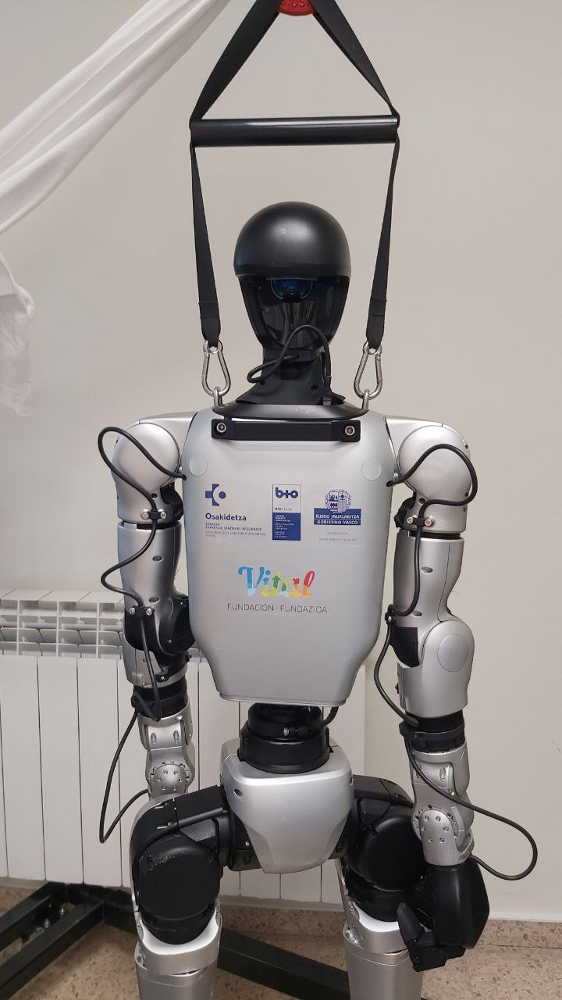
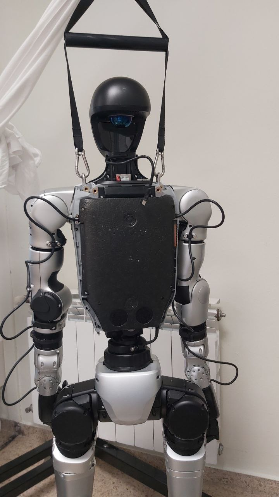
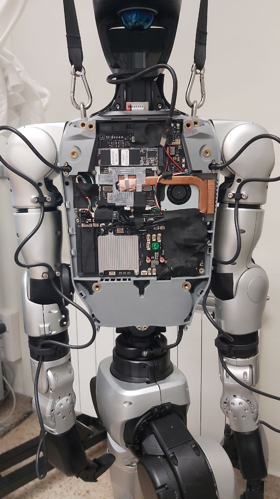
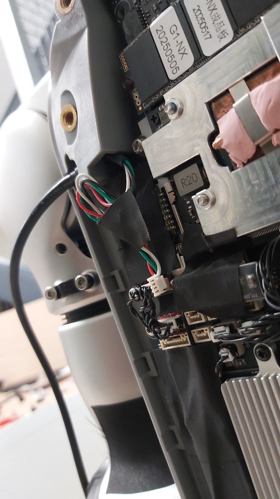
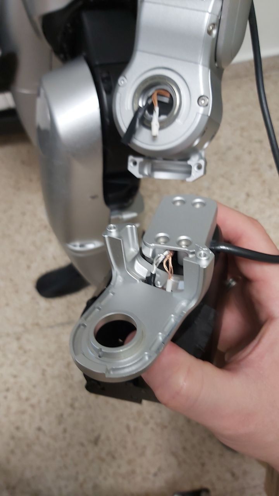
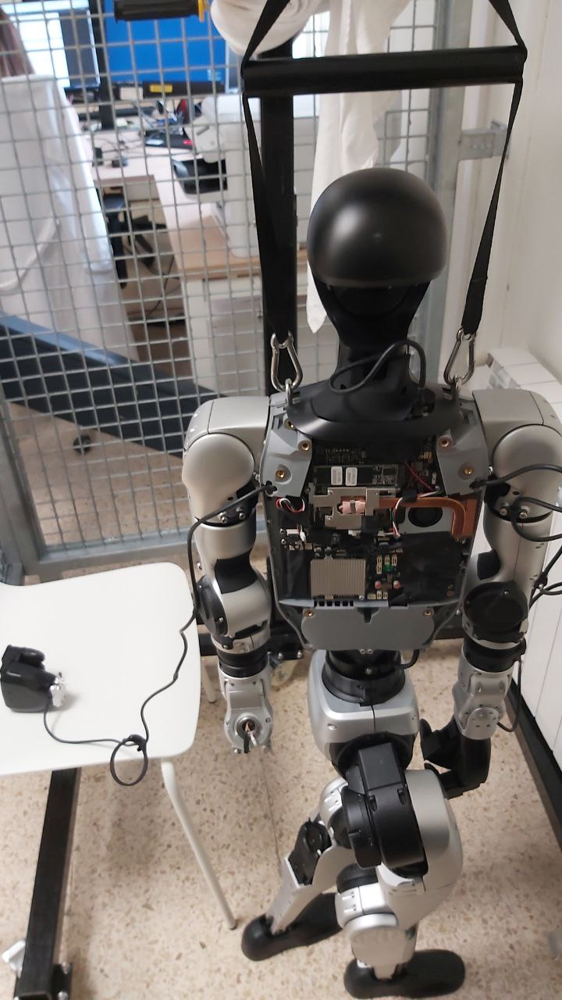
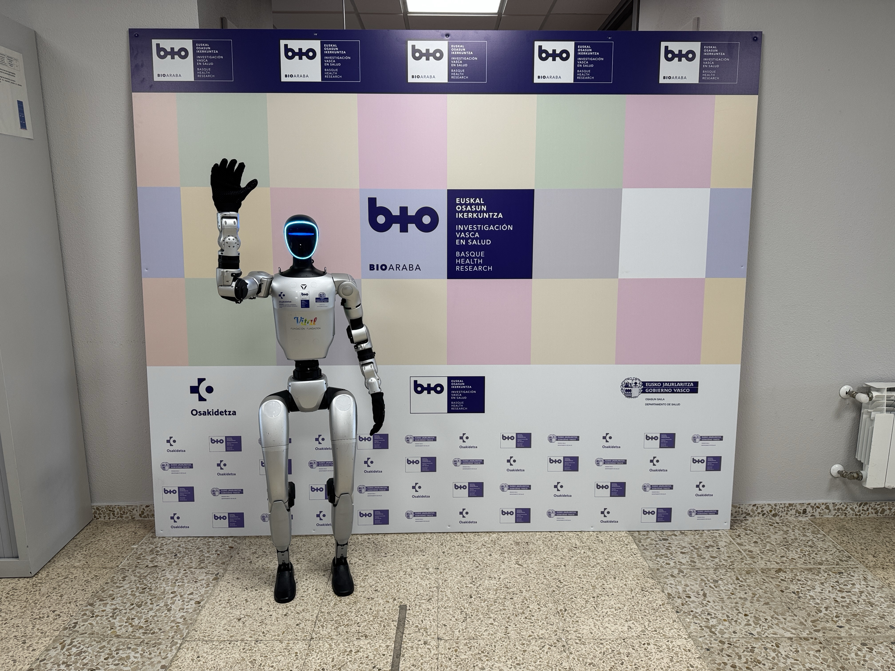

# 🧩 Disassembly Guide for DEX3 Hands (Unitree G1-EDU)

This document describes **how to disassemble the DEX3 hands** of the Unitree G1-EDU humanoid robot step by step.

---

## 🚨 POWER OFF THE ROBOT BEFORE STARTING 🚨

## 🚨 NEVER PERFORM THIS PROCESS WHILE THE ROBOT IS RUNNING 🚨

---

## 👣 Step 1

First, at the back, we must remove the two screws located on the robot's handle.

## 👣 Step 2

Once both screws are removed, we must gradually remove the back shell of the robot, leaving it as shown in the image.

## 👣 Step 3

We must keep the shell safe to reinstall it once we finish the process.

## 👣 Step 4

Now we are going to remove the protector to access the motherboard, which looks like this.

## 👣 Step 5

Once the protector is removed, we will locate the hand cables to disconnect them.

(White, black, green, and red cables).

## 👣 Step 6

Now we will go to the robot's wrist area, where we will remove the cover protecting the cables shown below in order to disconnect them.

## 👣 Step 7

Now we can remove the DEX3 hand.

## 👣 Step 8

This is how the removed hand looks from the back.

## 👣 Step 9

Repeat the process for the right hand and, upon completion, replace the back shell and the rubber hands if desired.

