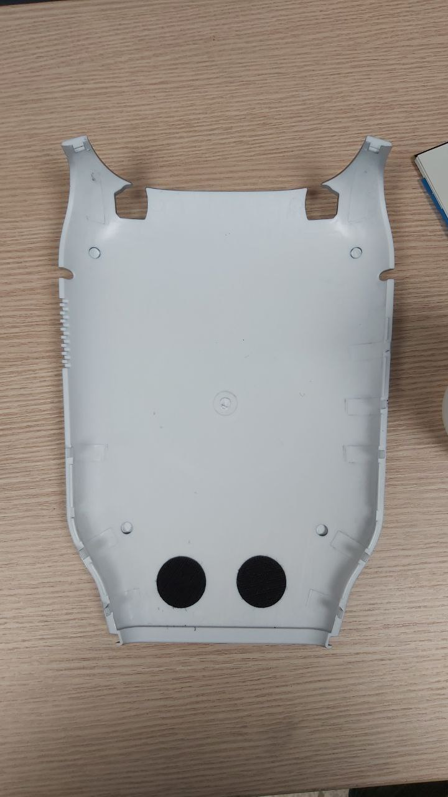
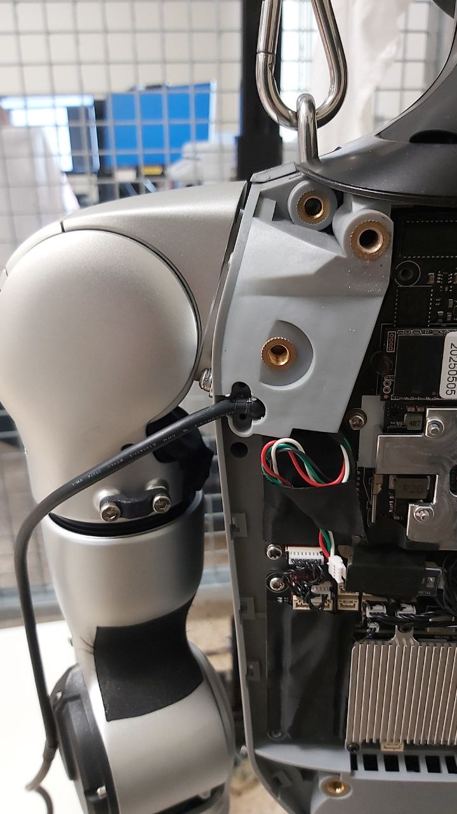
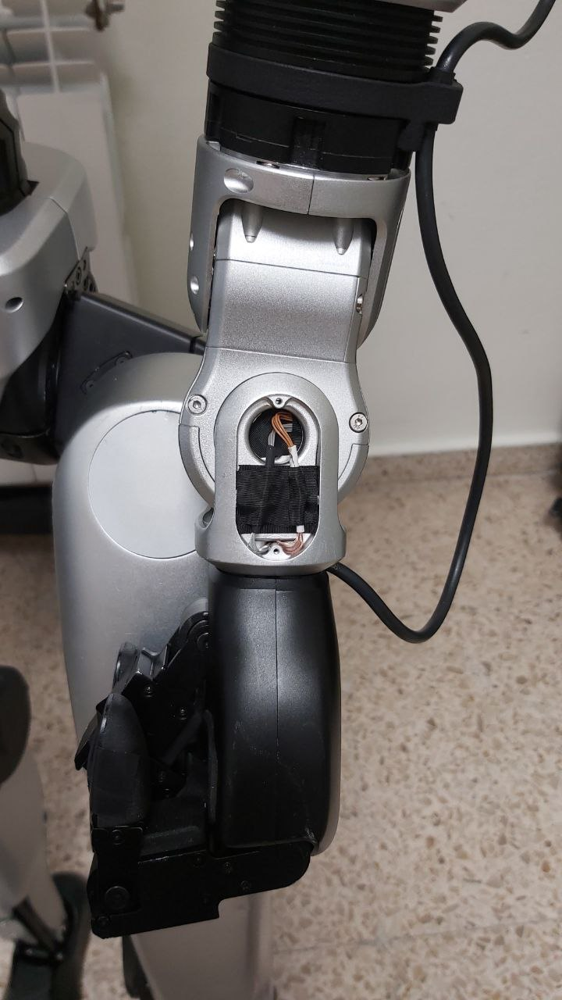

# 🧩 Guía para desmontar las manos DEX3 (Unitree G1-EDU)

Este documento describe **cómo desmontar las manos DEX3** del robot humanoide Unitree G1-EDU paso a paso.

---

## 🚨 APAGAR EL ROBOT ANTES DE EMPEZAR 🚨

## 🚨 NO REALIZAR NUNCA ESTE PROCESO CON EL ROBOT EN FUNCIONAMIENTO 🚨

---

## 👣 Paso 1

Primero, en la parte trasera, debemos sacar los dos tornillos que que se encuentran en el asa del robot.

## 👣 Paso 2

Una vez retirados ambos tornillos, debemos quitar poco a poco la carcasa trasera del robot, quedando este como se muestra en la imagen.

## 👣 Paso 3

Debemos guardar la carcasa para volver instalarla una vez terminemos el proceso.

## 👣 Paso 4

Ahora vamos a retirar el protector para poder acceder a la placa base, la cual se ve de esta forma.

## 👣 Paso 5

Una vez retirado el protector, buscaremos los cables de las manos para desconectarlos.

(Cables de color blanco, negro, verde y rojo).

## 👣 Paso 6

Ahora iremos a la parte de la muñeca delrobot, donde quitaremos la carcasa que cubre los cables mostrados a continuación para poder desconectarlos.

## 👣 Paso 7

Ahora podremos retirar la mano DEX3.

## 👣 Paso 8

Así quedaría la mano retirada visto desde atrás.

## 👣 Paso 9

Repetimos el proceso para la mano derecha y al terminar volvemos a colocar la carcasa trasera y las manos de goma si lo deseamos.

