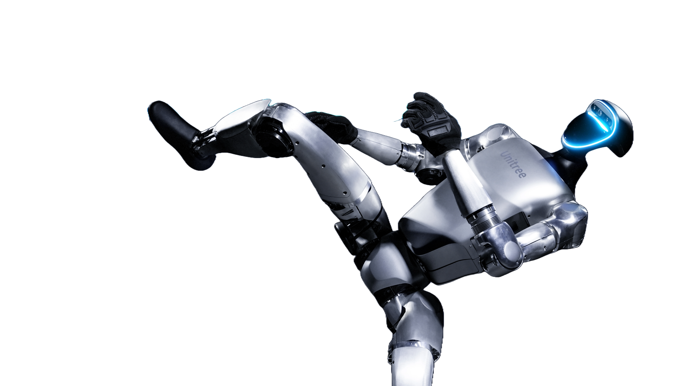
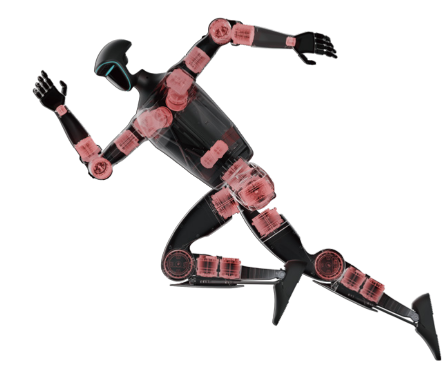
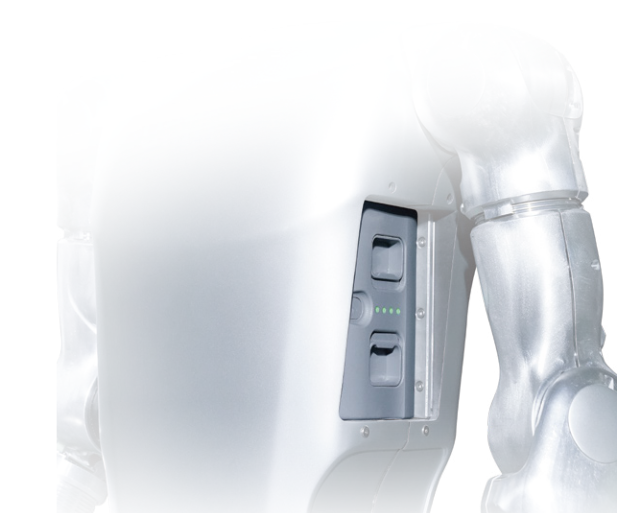

# G1 Robot Tutorial

The provided tutorial will assist you with setting up and operating your G1 bi-pedal robot.
The tutorial topics are listed in the left column and presented in the suggested reading order.

The Unitree G1 is a groundbreaking quadruped robot engineered for superior agility, versatility, and durability. Designed by Unitree Robotics, the G1 is equipped with advanced sensors, high-performance computing, and a robust modular design, making it ideal for a wide range of applications including industrial inspection, search and rescue, surveillance, and academic research. Whether navigating complex terrains or performing intricate tasks, the G1 combines cutting-edge technology with unparalleled functionality, setting a new standard in the world of robotics.

## Superior Joint Mobility

The Unitree G1 is engineered with an impressive range of joint movement, boasting 23 to 43 joint motors that provide extraordinary flexibility. This extensive joint mobility enables the G1 to execute complex maneuvers with precision, surpassing the capabilities of conventional robots. Whether navigating challenging terrains or performing intricate tasks, the G1's advanced articulation ensures optimal performance. Its design allows for fluid, human-like movements, making it ideal for applications that require agility and adaptability in diverse environments. The G1 sets a new standard for robotic flexibility and functionality.

 

## AI-Driven Learning and Adaptation

Harnessing advanced AI technologies, the Unitree G1 is driven by imitation and reinforcement learning. This cutting-edge approach enables the G1 to continuously evolve and improve its performance. By observing and mimicking human actions, the G1 refines its abilities, learning to execute tasks with greater efficiency and precision over time. Reinforcement learning further enhances this process by allowing the G1 to learn from its successes and errors, adapting to new challenges dynamically. This makes the G1 exceptionally powerful and versatile in ever-changing environments, capable of tackling complex tasks with increasing proficiency. The continuous improvement cycle facilitated by AI ensures that the G1 remains at the forefront of robotic innovation, providing reliable and intelligent solutions for a wide range of applications.

 

## Cutting-Edge Dexterous Hand Technology

The G1 introduces an advanced three-fingered dexterous hand (Dex3-1) equipped for precise manipulation tasks. Powered by a state-of-the-art force-position hybrid control system, this hand mirrors human dexterity, excelling in intricate and complex operations. The thumb boasts three active degrees of freedom, while the index and middle fingers each feature two, enabling delicate and sensitive object handling with remarkable precision. This technology sets new standards in robotics, offering unparalleled capabilities for a wide range of applications from manufacturing to healthcare and beyond.

 

## Revolutionizing Robotics with UnifoLM

Unitree invites collaboration in utilizing the Unified Large Model (UnifoLM), an innovative robot world model set to transform the realm of intelligent robotics. This cutting-edge platform empowers users to co-create and harness its capabilities, promising significant advancements in collective robotic functionalities across diverse applications. From revolutionizing autonomous systems to enhancing human-robot interactions, UnifoLM represents a pivotal leap forward in the evolution of intelligent robotics solutions.

 

# Technical Specifications

## Body and Dimensions

| Parameter                     | Specification |
| ----------------------------- | ------------- |
| **Weight:**                   | 35 kg         |
| **Height:**                   | 1270 mm       |
| **Total Degrees of Freedom:** | Up to 43      |
| **Max Joint Torque:**         | 120 N.m       |

## Perception and Sensing

| Parameter           | Specification                           |
| ------------------- | --------------------------------------- |
| **360° Detection:** | Equipped with 3D LIDAR and depth camera |
| **Cameras:**        | Intel RealSense D435 for depth sensing  |
| **LIDAR:**          | LIVOX-MID360 for precise mapping        |

## Mobility and Power

| Parameter                  | Specification                                    |
| -------------------------- | ------------------------------------------------ |
| **Movement Speed:**        | Up to 2m/s                                       |
| **Battery Life:**          | Approx. 2 hours with a 13-string lithium battery |
| **Quick Release Battery:** | Long-lasting power and easy replacement          |

# Model Variants

**G1:** Standard model with 23 degrees of freedom.

**G1 EDU:** Educational model offering similar features with additional development support.

The **G1 EDU:** model is available in the following versions:

- **Base:** Non-programmable, controllable only via a remote controller
- **U1:** Equipped with 40 TOPS (Tera Operations Per Second) of computing power
- **U2:** Includes an expansion dock with 100 TOPS of computing power
- **U3:** Features upgraded waist freedom, increasing degrees of freedom from 1 to 3. Additionally, the single arm degrees of freedom are upgraded from 5 to 7, with upgrades applied to both arms
- **U4:** Equipped with two Dex3-1 force-controlled, three-finger dexterous hands for advanced manipulation tasks

## Technical Comparison Table

| Model                                        | **G1**         | **G1 EDU**                                                                     |
| -------------------------------------------- | -------------- | ------------------------------------------------------------------------------ |
| *Mechanical Dimensions*                      |                |                                                                                |
| **Height, Width and Thickness (Stand)**      | 1270x450x200mm | 1270x450x200mm                                                                 |
| **Height, Width and Thickness (Fold)**       | 690x450x300mm  | 690x450x300mm                                                                  |
| **Weight (With Battery)**                    | About 35kg     | About 35kg+                                                                    |
| **Total Degrees of Freedom (Joint Freedom)** | 23             | 23 - 43                                                                        |
| **Single Leg Degrees of Freedom**            | 6              | 6                                                                              |
| **Waist Degrees of Freedom**                 | 1              | 1+(Optional 2 additional waist degrees of freedom)                             |
| **Single Arm Degrees of Freedom**            | 5              | 5                                                                              |
| **Single Hand Degrees of Freedom**           | /              | 7 (+2 wrist degrees): Optional three-fingered Dex3-1 hand with tactile sensors |
| **Maximum Torque of Knee Joint**             | 90N.m          | 120N.m                                                                         |
| **Arm Maximum Load**                         | About 2Kg      | About 3Kg                                                                      |
| **Calf + Thigh Length**                      | 0.6M           | 0.6M                                                                           |
| **Arm Span**                                 | About 0.45M    | About 0.45M                                                                    |

> **Important**
> - The maximum torque of the joint motors varies across different joints. The value listed is the maximum torque for the largest joint motor.
> - The arm's maximum load capacity varies significantly depending on the arm's extension posture.
> - The parameters listed above may change depending on the configuration and scenario. Please refer to the actual conditions.
> - The humanoid robot has a complex structure and powerful capabilities. Users are advised to maintain a safe distance from the robot. Use with caution.
> - If there are any changes in the product's appearance, please refer to the actual product.
> - Some features mentioned on this page are still under development and testing. They will be made available to users in the future.
> - This product is intended for civilian use only. Users should avoid making dangerous modifications or using the robot in hazardous ways.
> - For more information on terms, policies, and compliance with local laws and regulations, please visit the Unitree Robotics website.
