# G1 Overview

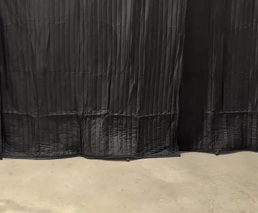

The G1 robot is divided into upper and lower bodies, each featuring multiple degrees of freedom. The single arm has five degrees of freedom, including the shoulder, upper arm, and elbow joints. The single leg features six degrees of freedom, comprising the hip, leg, knee, and ankle joints. The waist includes one degree of freedom, namely the lumbar joint.

The G1 basic version offers 23 degrees of freedom in total, allowing for precise motion and posture control through joint motors.

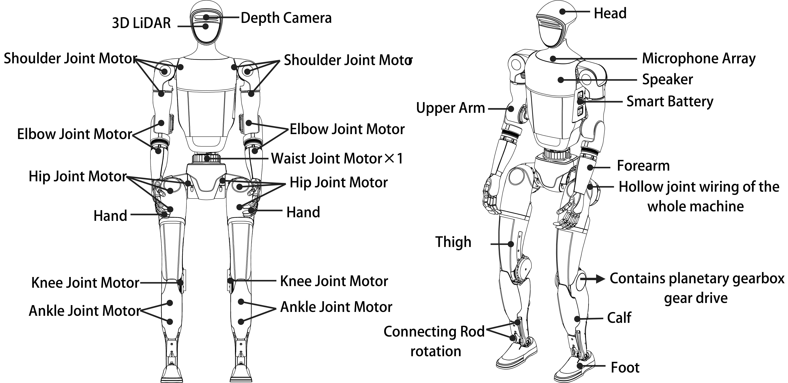

## G1-Edu Overview

The G1-EDU version builds upon the G1 basic model, expanding its capabilities for educational and research applications. It offers the same foundational configuration but includes options for additional degrees of freedom.

Optional upgrades include a dexterous hand with seven degrees of freedom and two additional wrist degrees of freedom, enhancing its manipulation abilities. The waist can also be upgraded with two extra degrees of freedom for advanced flexibility. Depending on the configuration, the G1-EDU can have up to 43 degrees of freedom, making it highly versatile for complex tasks.

## G1 Three-Fingered Dexterous Hand

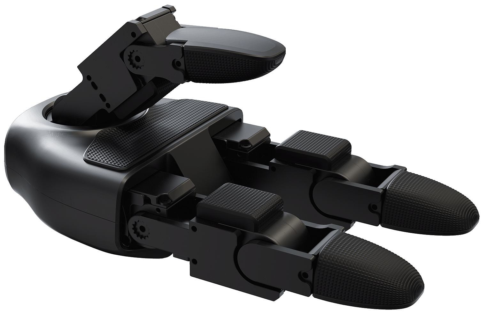

| Parameter                   | Specification                                                                                                                                   |
| --------------------------- | ----------------------------------------------------------------------------------------------------------------------------------------------- |
| **Rendering Image**         | 4                                                                                                                                               |
| **Operating Voltage**       | 12-58 V                                                                                                                                         |
| **Range of Perception**     | 10 g - 2500 g                                                                                                                                   |
| **Degrees of Freedom**      | Total: 7 - Thumb: 3 active degrees of freedom - Index Finger: 2 active degrees of freedom - Middle Finger: 2 active degrees of freedom |
| **Angle of Joint**          | Thumb: 0°~+100°, -35°~+60°, -60°~+60° Index Finger and Middle Finger: 0°~+90°, 0°~+100°                                                   |
| **Number of Array Sensors** | 9                                                                                                                                               |

## G1 Five-Fingered Dexterous Hand

The RH56 series Inspire robotic hands, comprising the RH56BFX and RH56DFX models, are designed for seamless integration with humanoid robots like the G1. With support for the RS485 communication interface, these hands are fully compatible with popular robotics platforms, including ROS (Robot Operating System). Their precise control, 6 degrees of freedom, and 12-joint design allow for high-performance dexterity suited for tasks requiring precision and adaptability. The RH56 series ensures reliable operation with features like consistent repeatability (±0.20mm), adjustable grip force, and flexible motion ranges, making them an ideal choice for humanoid robotics and other advanced robotic systems.

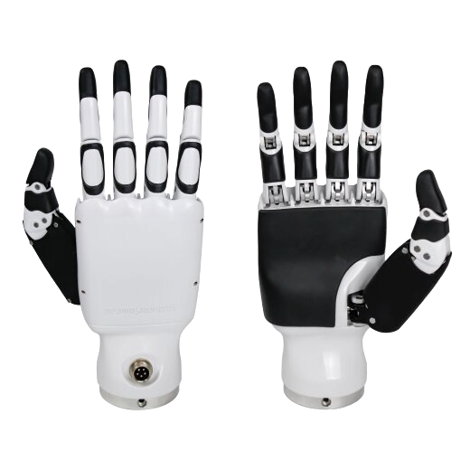

| Parameter                        | RH56BFX Specification | RH56DFX Specification |
| -------------------------------- | --------------------- | --------------------- |
| **Control Interface**            | RS485                 | RS485                 |
| **Degrees of Freedom**           | 6                     | 6                     |
| **Number of Joints**             | 12                    | 12                    |
| **Weight**                       | 540g                  | 540g                  |
| **Operating Voltage**            | DC24V±10%             | DC24V±10%             |
| **Quiescent Current**            | 0.20A                 | 0.20A                 |
| **Peak Current**                 | 2A                    | 2A                    |
| **Repeatability**                | ±0.20mm               | ±0.20mm               |
| **Maximum Thumb Grip**           | 6N                    | 15N                   |
| **Maximum Palm Finger Grip**     | 4N                    | 10N                   |
| **Force Resolution**             | 0.50N                 | 0.50N                 |
| **Thumb Lateral Rotation Range** | > 65°                 | > 65°                 |
| **Thumb Lateral Rotation Speed** | 235°/s                | 107°/s                |
| **Thumb Bend Speed**             | 150°/s                | 70°/s                 |
| **Palm Finger Bend Speed**       | 570°/s                | 260°/s                |

## G1 Radar and Camera FOV

The G1 robot is equipped with advanced sensory systems, including the LIVOX-MID360 laser radar and the D435i depth camera, which work in unison to provide superior environmental perception and spatial awareness.

### LIVOX-MID360 Laser Radar

The LIVOX-MID360 laser radar is integrated into the G1 head, offering exceptional environmental sensing capabilities. This lidar employs omnidirectional and full-angle scanning technology, achieving a horizontal field of view (FOV) of up to 360° and a maximum vertical angle of 59°. These features enable the G1 to acquire precise, real-time environmental data and generate high-resolution point cloud information. The system rapidly detects and measures objects in its surroundings, ensuring accurate and comprehensive spatial awareness.

*MID360 Laser Radar FOV*

### D435i Depth Camera

The G1 is also equipped with the D435i depth camera, enhancing its visual perception capabilities. This camera allows the robot to perceive and interpret its environment with greater accuracy, enabling precise spatial awareness and obstacle detection. These features facilitate intelligent and flexible interactions with the environment, allowing the G1 to adapt effectively to various scenarios.

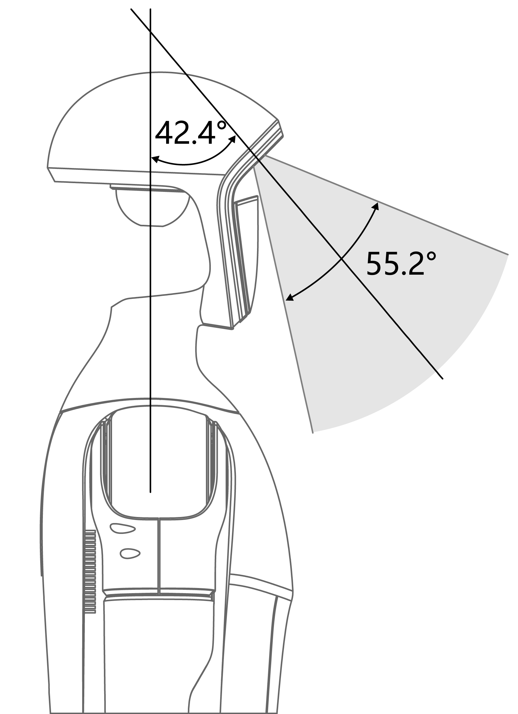

*D435i Depth Camera FOV*

### Combined FOV of MID360 and D435i

The integration of the LIVOX-MID360 laser radar and the D435i depth camera provides a merged field of view, enabling the G1 robot to achieve unparalleled environmental perception and adaptability. Together, these sensors ensure the G1 can operate effectively across diverse tasks and dynamic environments.

*MID360+D435i Merged FOV*

## G1 Installation Holes

**Unit: mm**

To utilize the G1 mounting holes, ensure the label covering the holes is removed before installation.

|                                                                                                             |                                                                                                           |
| ----------------------------------------------------------------------------------------------------------- | --------------------------------------------------------------------------------------------------------- |
| 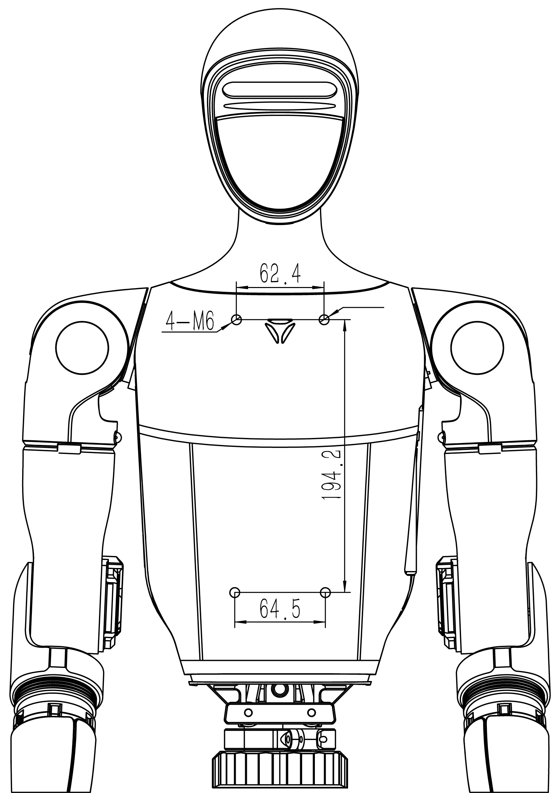 *G1 Mounting Holes Front* | 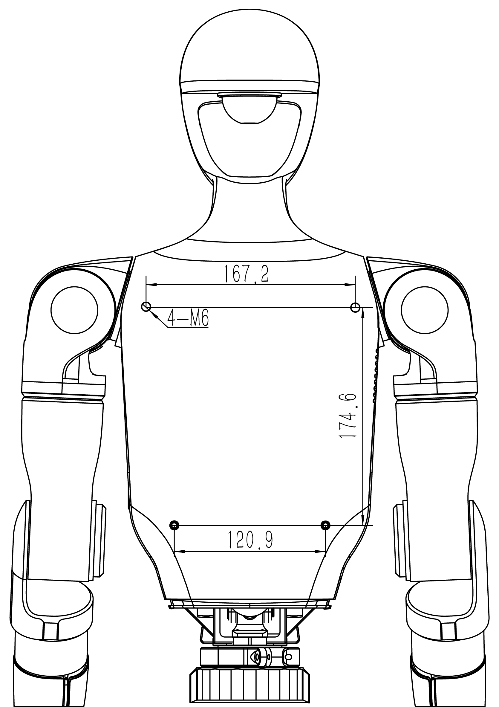 *G1 Mounting Holes Back* |

## G1 Electrical Interface

The back of the **G1 robot's neck** is equipped with a range of electrical interfaces designed for connecting body joint motors, sensor peripherals, network ports, and more. This design simplifies debugging, troubleshooting, and secondary development, making the system highly versatile and user-friendly.

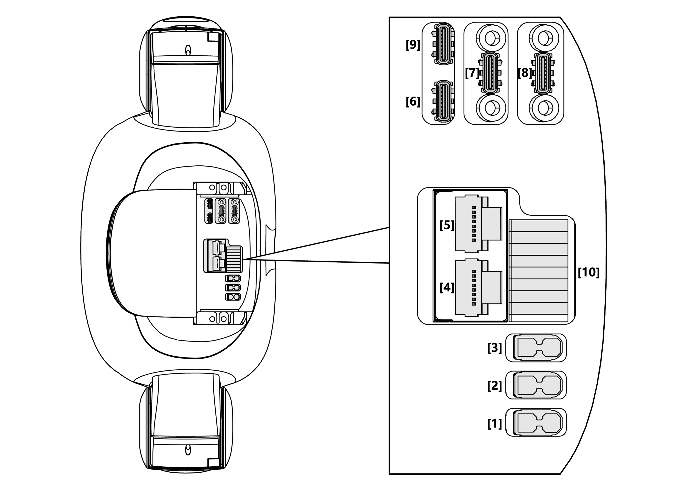

*Top View of G1 Electrical Interface*

Below is a description of the connectors and their respective interface specifications:

| No  | Connector Name | Interface Description (Short) | Interface Specification                             |
| --- | -------------- | ----------------------------- | --------------------------------------------------- |
| 1   | XT30UPB-F      | VBAT                          | Battery power output (direct connection to battery) |
| 2   | XT30UPB-F      | 24V                           | 24V/5A power output                                 |
| 3   | XT30UPB-F      | 12V                           | 12V/5A power output                                 |
| 4   | RJ45           | 1000 BASE-T                   | Gigabit Ethernet (GbE)                              |
| 5   | RJ45           | 1000 BASE-T                   | Gigabit Ethernet (GbE)                              |
| 6   | Type-C         | Type-C                        | Supports USB3.0 host, 5V/1.5A power output          |
| 7   | Type-C         | Type-C                        | Supports USB3.0 host, 5V/1.5A power output          |
| 8   | Type-C         | Type-C                        | Supports USB3.0 host, 5V/1.5A power output          |
| 9   | Type-C         | Alt Mode Type-C               | Supports USB3.2 host and DP1.4                      |
| 10  | 5577           | I/O OUT                       | 12V/3A power output                                 |

### GPIO Details

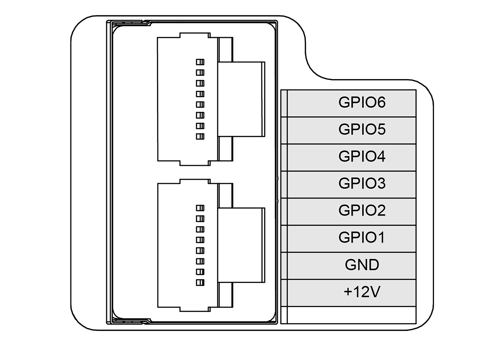

*G1 RJ45 and the IO Interface*

Refer to the following table for GPIO configurations:

| GPIO Number | NX Pin Number | Multiplexing Relationship | Debugfs File System Pin Name |
| ----------- | ------------- | ------------------------- | ---------------------------- |
| GPIO1       | 203           | UART1_TXD                 | GPIO3_PR.02                  |
| GPIO2       | 205           | UART1_RXD                 | GPIO3_PR.03                  |
| GPIO3       | 232           | I2C2_SCL                  | GPIO3_PI.03                  |
| GPIO4       | 234           | I2C2_SDA                  | GPIO3_PI.04                  |
| GPIO5       | 128           | GPIO                      | GPIO3_PCC.02                 |
| GPIO6       | 130           | GPIO                      | GPIO3_PCC.03                 |

> **Note**
> NVIDIA GPIO operations can be performed in various ways. For more information on NVIDIA GPIO definitions and usage, refer to the following documentation: [NVIDIA Jetson Developer Guide](https://docs.nvidia.com/jetson/archives/r35.2.1/DeveloperGuide/text/HR/JetsonModuleAdaptationAndBringUp/JetsonOrinNxSeries.html#identifying-the-gpio-number).

## G1 On-Board Computer

The G1-EDU onboard system is equipped with one standard operation and control computing unit, along with one development computing unit.

### Development Computing Unit (PC 2)

| Parameter                             | Specification                                             |
| ------------------------------------- | --------------------------------------------------------- |
| **Model**                             | Jetson Orin NX                                            |
| **CPU**                               | Arm® Cortex®-A78AE                                        |
| **Number of Cores**                   | 8                                                         |
| **Number of Threads**                 | 8                                                         |
| **Maximum Clock Speed**               | 2 GHz                                                     |
| **Graphics Memory**                   | 16 GB                                                     |
| **Total Memory**                      | 16 GB                                                     |
| **Cache**                             | 2 MB L2 + 4 MB L3                                         |
| **Storage**                           | 2 TB                                                      |
| **Intel® Image Processing Unit**      | Not Present                                               |
| **GPU**                               | 1024 NVIDIA Ampere Architecture GPUs with 32 Tensor Cores |
| **Maximum GPU Frequency**             | 918 MHz                                                   |
| **Gaussian and Neural Accelerator**   | 3.0                                                       |
| **Intel® Deep Learning Boost**        | Yes                                                       |
| **Intel® Adaptix™ Technology**        | Yes                                                       |
| **Intel® Hyper-Threading Technology** | Yes                                                       |
| **Instruction Set**                   | 64-bit                                                    |
| **OpenGL**                            | 4.6                                                       |
| **OpenCL**                            | 3.0                                                       |
| **DirectX**                           | 12.1                                                      |
| **IP Address**                        | 192.168.123.164                                           |

> **Attention**
> The **Operation and Control Computing Unit** is exclusively dedicated to the Unitree motion control program and is not accessible for public use. Developers are only permitted to utilize the **Development Computing Unit** for secondary development purposes. For access to the initial user password, please see FAQ.
>
> In the table, the **PC2 [Development Computing Unit]** is assigned the IP address **192.168.123.164**.
>
> Please note that the CPU modules may be shipped with a more advanced version, but the performance will meet or exceed the specifications listed above.

## G1 Joint Motor

The **G1 joint motor** utilizes a self-developed Unitree motor that demonstrates exceptional performance and characteristics. With a maximum torque of 120 N·m, the motor features a hollow axis design, contributing to a more compact and lightweight structure. Additionally, the motor is equipped with dual encoders, enabling precise position and velocity feedback, which is essential for high-precision control requirements.

### Joint Serial Number and Limits

The following table provides the joint indices, names, and respective joint limits in radians:

| Index | Joint Name        | Limit (rad)        |
| ----- | ----------------- | ------------------ |
| 0     | L_LEG_HIP_PITCH   | -2.5307 ~ 2.8798   |
| 1     | L_LEG_HIP_ROLL    | -0.5236 ~ 2.9671   |
| 2     | L_LEG_HIP_YAW     | -2.7576 ~ 2.7576   |
| 3     | L_LEG_KNEE        | -0.087267 ~ 2.8798 |
| 4     | L_LEG_ANKLE_PITCH | -0.87267 ~ 0.5236  |
| 5     | L_LEG_ANKLE_ROLL  | -0.2618 ~ 0.2618   |
| 6     | R_LEG_HIP_PITCH   | -2.5307 ~ 2.8798   |
| 7     | R_LEG_HIP_ROLL    | -2.9671 ~ 0.5236   |
| 8     | R_LEG_HIP_YAW     | -2.7576 ~ 2.7576   |
| 9     | R_LEG_KNEE        | -0.087267 ~ 2.8798 |
| 10    | R_LEG_ANKLE_PITCH | -0.87267 ~ 0.5236  |
| 11    | R_LEG_ANKLE_ROLL  | -0.2618 ~ 0.2618   |
| 12    | WAIST_YAW         | -2.618 ~ 2.618     |
| 13    | WAIST_ROLL        | -0.52 ~ 0.52       |
| 14    | WAIST_PITCH       | -0.52 ~ 0.52       |
| 15    | L_SHOULDER_PITCH  | -3.0892 ~ 2.6704   |
| 16    | L_SHOULDER_ROLL   | -1.5882 ~ 2.2515   |
| 17    | L_SHOULDER_YAW    | -2.618 ~ 2.618     |
| 18    | L_ELBOW           | -1.0472 ~ 2.0944   |
| 19    | L_WRIST_ROLL      | -1.9722 ~ 1.9722   |
| 20    | L_WRIST_PITCH     | -1.6144 ~ 1.6144   |
| 21    | L_WRIST_YAW       | -1.6144 ~ 1.6144   |
| 22    | R_SHOULDER_PITCH  | -3.0892 ~ 2.6704   |
| 23    | R_SHOULDER_ROLL   | -2.2515 ~ 1.5882   |
| 24    | R_SHOULDER_YAW    | -2.618 ~ 2.618     |
| 25    | R_ELBOW           | -1.0472 ~ 2.0944   |
| 26    | R_WRIST_ROLL      | -1.9722 ~ 1.9722   |
| 27    | R_WRIST_PITCH     | -1.6144 ~ 1.6144   |
| 28    | R_WRIST_YAW       | -1.6144 ~ 1.6144   |

### Reference Frame, Joint Axes, and Zero Position

When all joints are in their zero positions, the coordinate systems for the joints are as follows:

- The **X-axis** is represented in **red**.
- The **Y-axis** is represented in **green**.
- The **Z-axis** is represented in **blue**.

|                                                   |                                                   |
| ------------------------------------------------- | ------------------------------------------------- |
| 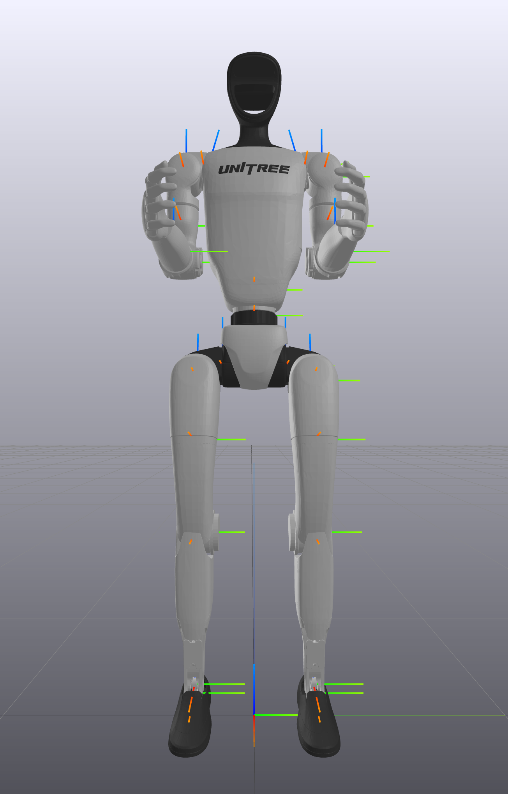 *G1 23 DOF* | 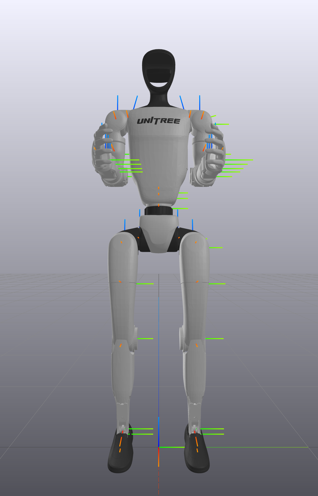 *G1 29 DOF* |

