# G1 Manuals

The following text contains hyperlinks. Click on them to be redirected to the websites.

- [Unitree Documentation](https://support.unitree.com/home/en/G1_developer)

# G1 Mobile Apps

The QR codes for Android and iOS to download the G1 app are provided below. Please scan the respective QR code to access the download link.

|  |  |
| :-------------------------------------------: | :-----------------------------------: |
|       **Scan to download for Android**        |     **Scan to download for iOS**      |

---

# G1 Itinerary and Transport

The G1 humanoid robot is designed with a compact and lightweight structure, making it easy to transport and handle. Its foldable design allows it to be neatly stored in the provided suitcase, which includes the Unitree G1 humanoid robot, a remote controller, and a charger. While the suitcase ensures convenience, its built-in wheels are not suitable for outdoor use. Therefore, it is **recommended** to use an additional trolley for enhanced mobility, particularly in outdoor environments. This combination of thoughtful design and practical packaging ensures that the G1 stands out as a highly portable option compared to other humanoid robots, offering both ease of transport and reliable protection for its components.

| 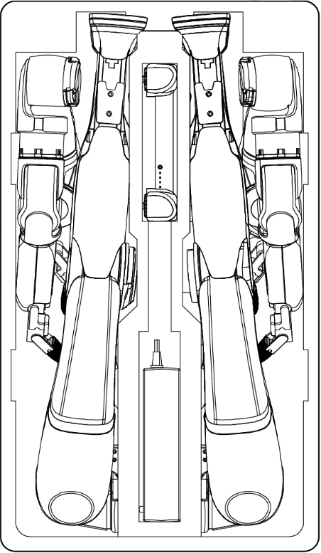 | 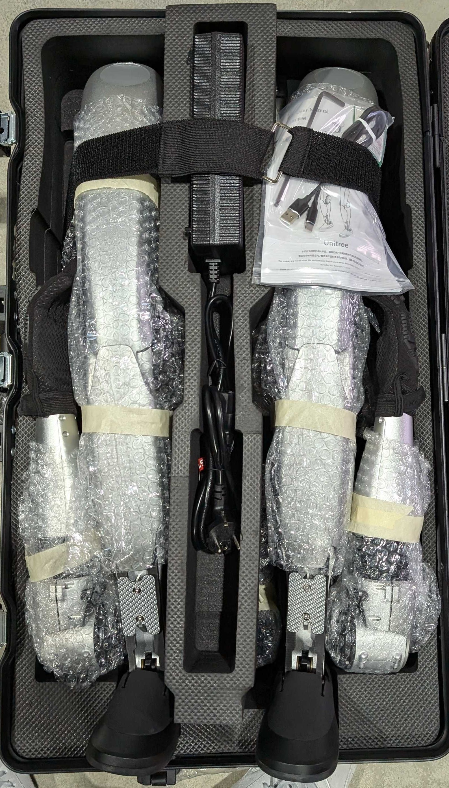 |
| :--------------------------------------------: | :-----------------------------------------: |

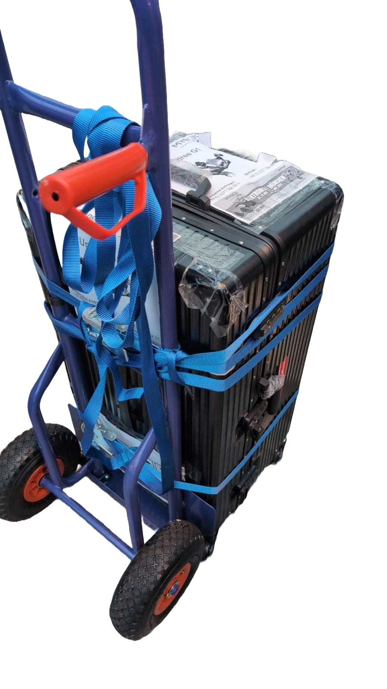
*G1 Trolley for Easy Transport*

> **Note**
> Always handle the suitcase with care to prevent damage to the robot and accessories during transport.

---

# G1 Charging

Proper charging procedures are essential to ensure the safe and efficient operation of your Unitree G1 Humanoid Robot. Follow the guidelines below for charging the main battery and the companion remote control.

## Battery Charging

Due to self-discharge during transportation and storage, the battery may have low or no power initially. Use the following steps to charge the main battery:

1. **Remove the battery**: Detach the battery from the G1 body. Ensure the battery pack strap is pulled out.

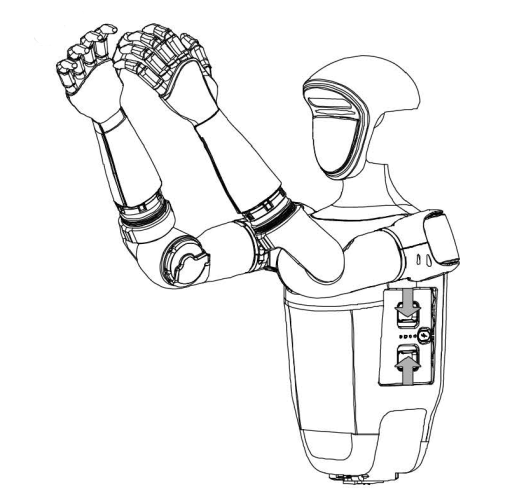

2. **Prepare the charger**:
   - Connect the charger to an AC power source (100-240V, 50/60Hz).
   - Verify that the external power supply voltage matches the charger's rated input voltage (marked on the charger's nameplate). Failure to match voltages may damage the charger.

3. **Connect the battery**:
   - Plug the charger into the AC power supply first.
   - Ensure the battery pack is switched off before connecting it to the charger to avoid damage.

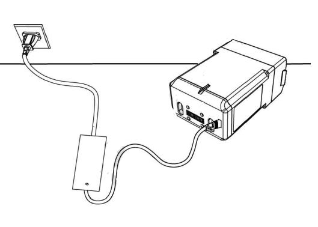

4. **Monitor charging status**:
   - During charging, the battery indicator on the battery pack will flash at a frequency of 1Hz (once per second), displaying the current charge level.
   - When fully charged, the battery indicator will turn off. Manually disconnect the charger and battery to complete the process.

5. **Temperature precautions**:
   - Allow the battery to cool to room temperature before charging if it is warm from recent use.

> **Warning**
> Only use official chargers to charge the G1 battery. Using unofficial chargers may cause damage or safety hazards.

## Remote Control Charging

The companion remote control requires proper charging to maintain functionality. Follow these steps:

1. Use a **5V/2A USB charger** that meets FCC/CE standards.
2. Ensure the remote control is **switched off** before charging.
3. Connect the remote control to the charger using a USB-Type C cable.
4. Observe the charging indicator light:
   - The power indicator will flash at 1Hz (once per second) during charging, showing the current charge level.
   - When the indicator turns off, charging is complete. Disconnect the charger.

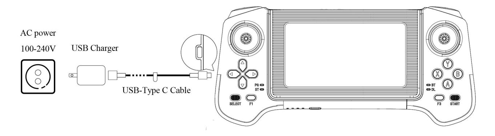

## Remote Charging Indicator

The charging indicator lights display the current charge level as shown in the table below:

| Indicator Lights | Current Battery | Description          |
| ---------------- | --------------- | -------------------- |
| LED1             | 0%-25%          | Lowest battery level |
| LED1, LED2       | 25%-50%         | Partial charge       |
| LED1, LED2, LED3 | 50%-75%         | Moderate charge      |
| All LEDs         | 75%-100%        | Fully charged        |

> **Note**
> For optimal battery life, avoid overcharging and ensure all devices are disconnected after charging.

---

# G1 Unpacking and Initial Setup

Follow the steps below to properly unpack and prepare the Unitree G1 Humanoid Robot for operation.

## Unpacking

1. Place the box on a **flat surface** with the front side facing up.
2. Open the top of the box and carefully lift the robot out in its entirety.
3. Remove all components, including the robot, remote control, charger, and accessories.
4. Place the robot flat on a stable surface in preparation for powering it on.

> **Important**
> Handle all components with care to avoid damage during unpacking.

## Pre-Power-On Checklist

Before powering on the G1, ensure the following:

1. **Use only authentic Unitree Robotics parts** and confirm that all parts are in good working condition.
2. **Do not operate the robot** if you are intoxicated, under the influence of drugs, or unable to concentrate.
3. Familiarize yourself with:
   - Characteristics of each gait mode.
   - The **emergency braking method** in case of instability or loss of control.
4. Check that there are no foreign objects (e.g., water, oil, sand, or soil) inside the robot or its components.
5. Ensure the remote control and battery pack are fully charged.

---

# G1 Packing

## Packing Steps from Hanging Position

> **Important**
> Be careful to avoid pinching your hands at movement joints during the packing process.

1. Hang G1 vertically using the suspension system.
2. Lift the robot's legs and fold them back until the waist is level, ensuring proper direction.
3. Slowly lower the suspension rope to guide the robot's rear into the transport box.
4. Place G1 head and chest down, lying flat in the box, ensuring correct orientation.
5. Position the robot's arms along its sides, rotating the wrists vertically to fit into the box.
6. Fold the legs back towards the body and ensure they fit snugly against the lining.
7. Add protective buffers to prevent collisions, place accessories (remote control, charger, etc.), and secure the square lining in the middle of G1.

## Packing Steps from a Lying Position on the Ground

> **Caution**
> This process requires **two persons** for safe handling.

1. Place G1 head and chest down, lying flat on the ground, ensuring proper orientation.

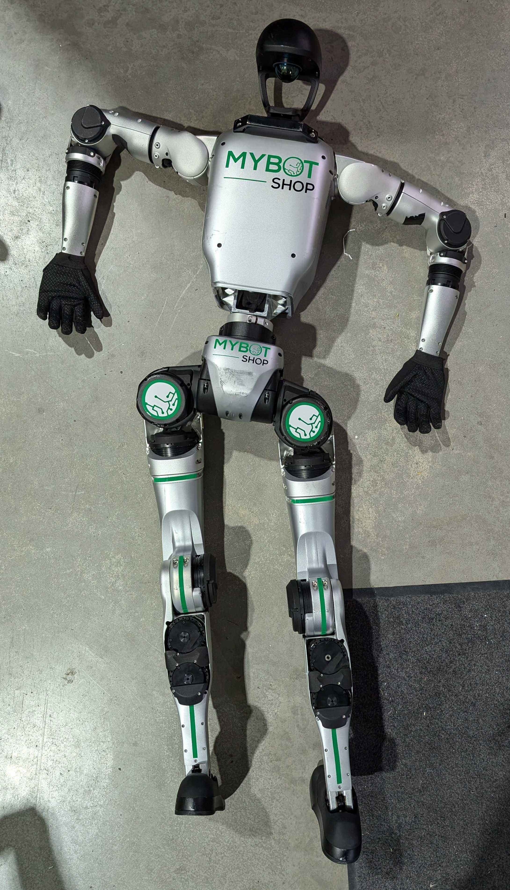

2. Prepare the transport box next to the robot.
3. Lift G1's legs and arms and carefully place it into the box with its head and chest down.

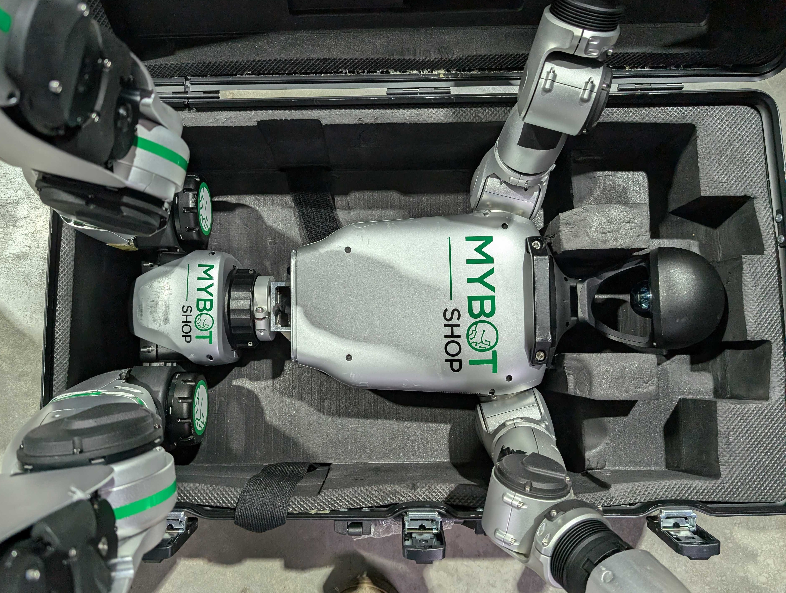

4. Twist and fold the arms as shown in the provided GIFs:

|  |  |
| :-----------------------------------------------------: | :-------------------------------------------------------: |
|                  **Left Arm Folding**                   |                   **Right Arm Folding**                   |

5. Fold the legs back towards the body and ensure they fit snugly against the lining.

| 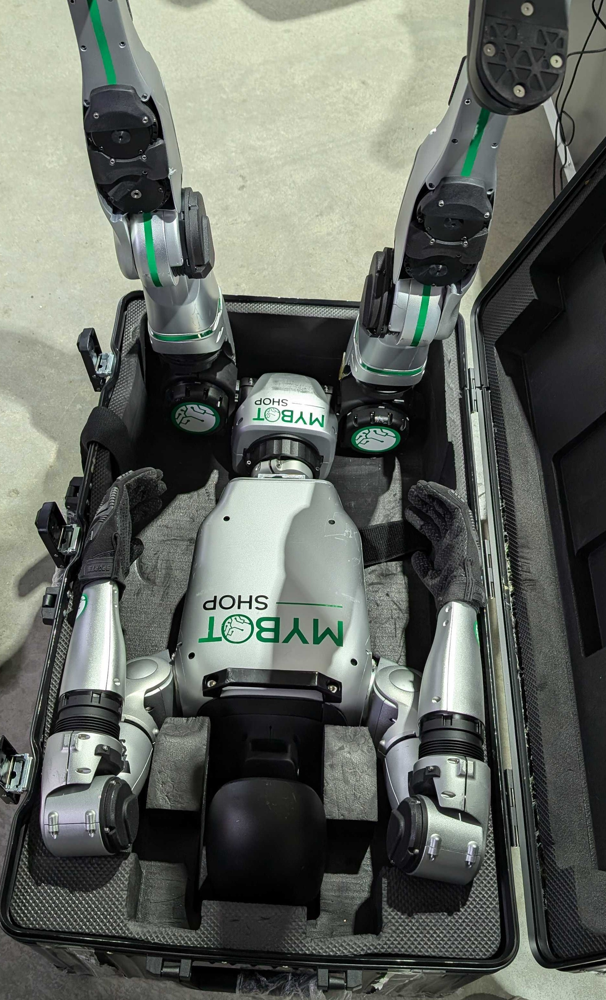 | 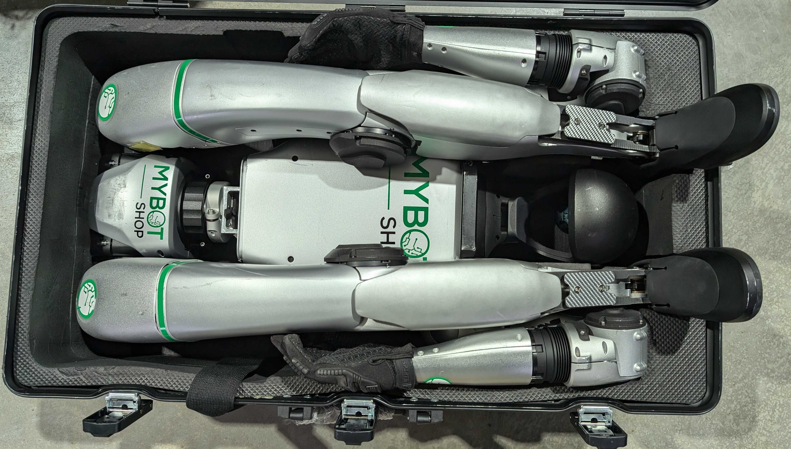 |
| :---------------------------------------: | :-------------------------------------------: |

6. Add protective buffers, include accessories (remote control, charger, etc.), and secure the square lining in the middle of G1.

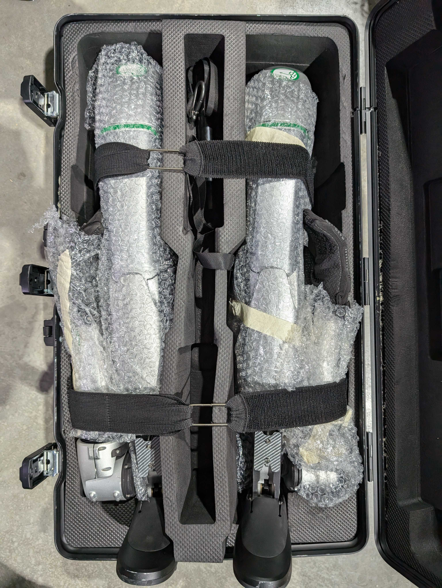
