# G1 Operation (Firmware V1.0.4)

## G1 Powering On

> **Attention**
> If the G1 enters an unexpected state, press **L2 + B**. The robot will enter damping mode and **slowly fall to the ground**.

### Installing Battery Pack

1. Insert the battery into the battery compartment on the side of the robot.
2. Ensure the **power switch faces the back** of the robot.
3. If the battery does not fully insert, adjust its direction. **Do not forcefully press it** to avoid damaging the battery interface and buckle.
4. Listen for a **"click"** sound, indicating the battery is securely installed. Verify the buckle is in place.

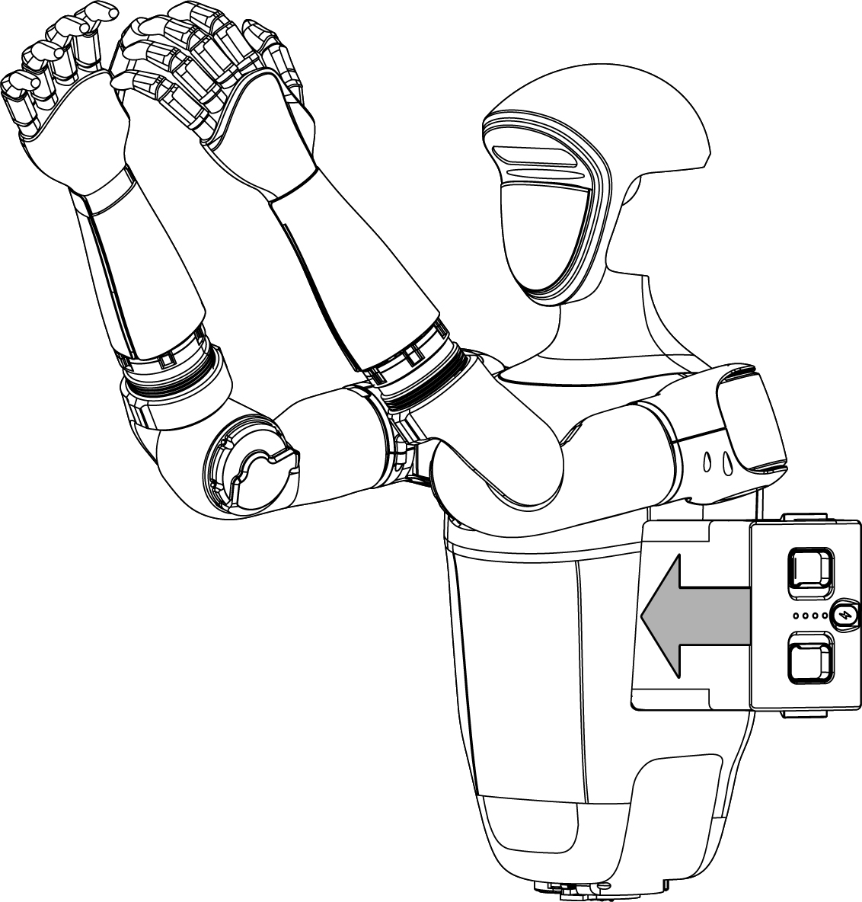

---

## Sit & Power On [Method 1]

### Preparation Before Startup

If conditions permit, G1 supports booting while seated. Place G1 on a chair with arms and legs positioned naturally, as shown in the following image.

### Powering On

1. Short-press the power button on the battery once.
2. Press and hold the power button for more than 2 seconds to power on the battery.

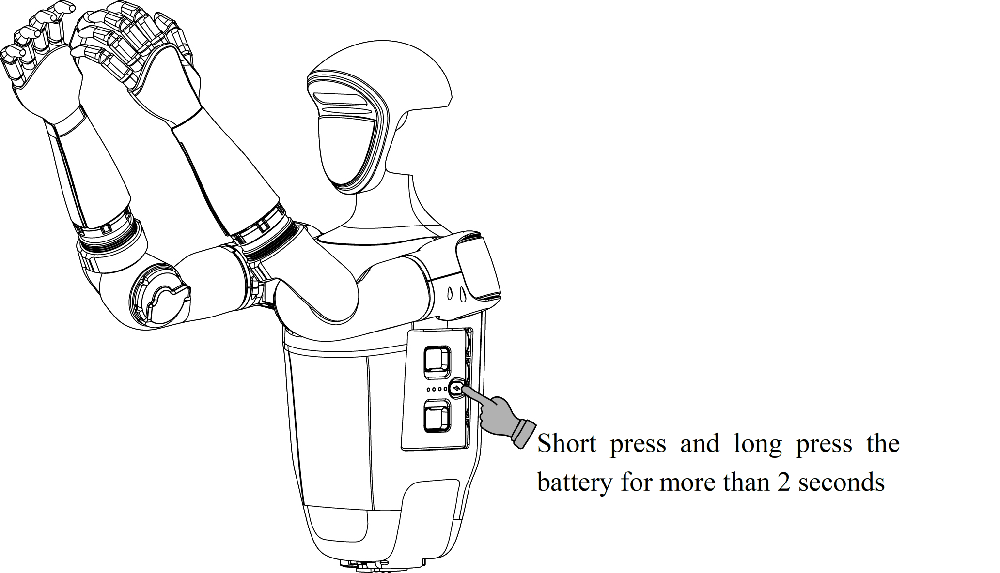

### Successful Boot

1. Wait approximately **1 minute** for the G1 to enter the **zero torque state**.
2. Press `L2 + B` to enter damping mode.
3. Hold the G1's shoulder and press `L2 + UP` to help it enter the ready state.
4. Once G1 straightens and stands, you can press:
   - `R2 + A` to enter operation control state.

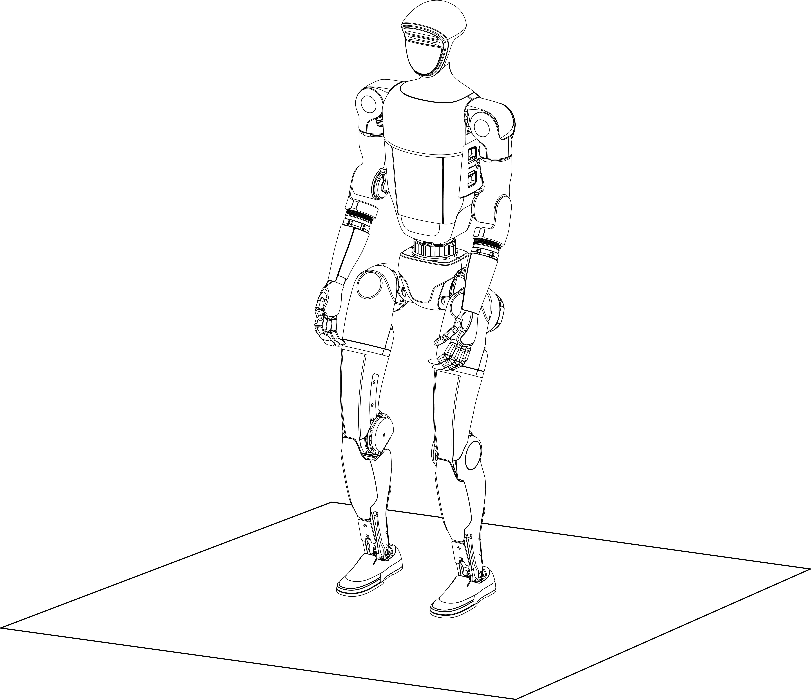

---

## Hang & Power On [Method 2]

The following steps guide you through the process of hanging, preparing, and powering on the Unitree G1 Humanoid Robot.

### Preparation Before Startup

1. Place the G1 steadily on the ground.
2. Thread a rope through the **special suspension buckles** located on both shoulders of the robot. Tie the rope securely with a dead knot.
3. Attach the rope to the **suspension buckle** of the protective frame.
4. Gradually raise the G1 by adjusting the support, ensuring the robot's body is fully suspended and its feet do not touch the ground.

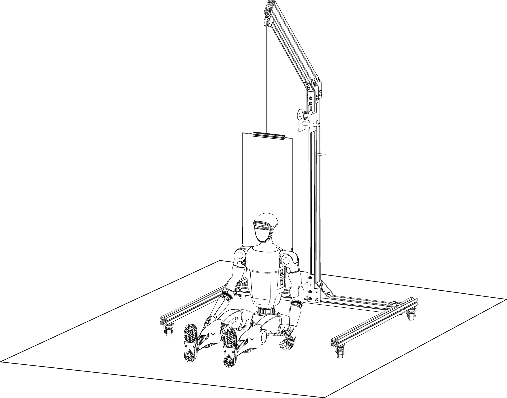

### Body Placement

- While hanging, position the robot's arms and legs naturally.
- Ensure the joints are **not entangled** before proceeding.

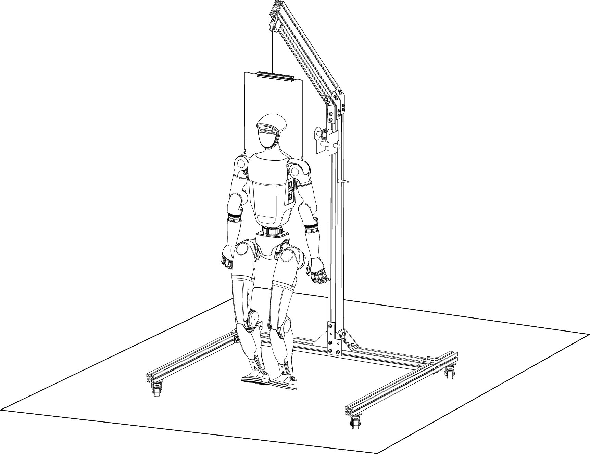

### Starting Up the Robot

1. Short-press the power button on the battery once.
2. Press and hold the power button for more than 2 seconds to power on the battery.

### Boot Process

- The boot process takes approximately **1 minute**.
- When all joints enter the **zero torque state**, the initialization is successful.

3. Use the remote control:
   - Press `L2 + B` to enter damping mode and unlock control.
   - Press `L2 + UP` to enter the ready state.

The G1 will assume a neutral posture, as shown in the following image.

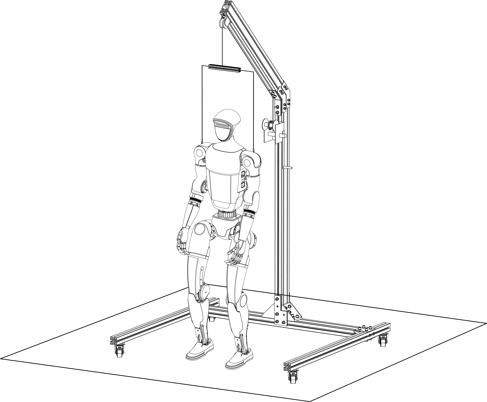

### Lowering and Activating the Robot

1. Gradually lower the suspension rope until the G1's feet touch the ground.
2. Press `R2 + A` on the remote control.
   - The control program will start, transitioning G1 from the ready state to the motion state.
3. Allow the robot to stabilize its movement.

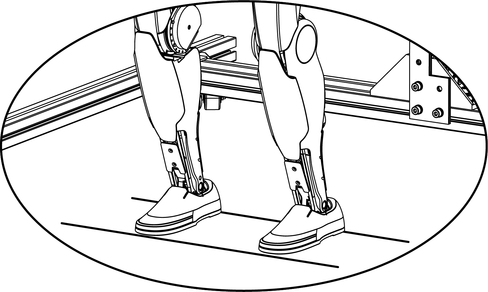

### Unlocking the Hanging Rope

- Once the G1 is stable, fully release the suspension hook.
- Use the **left and right joysticks** on the remote control to control the G1's movements.
- Press **START** on the remote to switch between standing and walking states.

---

## Start from Ground [Method 3]

Follow these steps to safely start up the G1 robot from a grounded position.

### Preparation Before Startup

- Place the G1 steadily on the ground Facing Up.
- Ensure the joints are **not entangled** before proceeding.
- Always ensure the robot is on a **stable, non-slippery surface** to prevent accidental falls or damage.

### Starting Up the Robot

1. Short-press the power button on the battery once.
2. Press and hold the power button for more than 2 seconds to power on the battery.

### Boot Process

- The boot process takes approximately **1 minute**.
- When all joints enter the **zero torque state**, the initialization is successful.

### Using the Remote Control

1. Press `L2 + B` to enter damping mode and unlock control.
2. Press `L2 + X` to activate the **Lying Down and Standing Up Mode**.

> **Attention**
> Maintain a **safe distance** as the robot will start to get up on its own.

The G1 will rise from the ground, as illustrated in the following GIF:

---

## Emergency Stop

If the G1 enters an unexpected state, press **L2 + B**. The robot will enter damping mode and **slowly fall to the ground**.

> **Attention**
> Always ensure the suspension setup is stable and secure to prevent damage or accidents during operation.

---

## G1 Switching Off

Follow these procedures to safely switch off the G1 robot in various scenarios.

### Sitting Shutdown [Method 1]

1. Stand behind the chair to assist the G1 robot in sitting, while the robot stands in front of the chair facing away from it. Ensure the robot remains stationary.
2. Hold the back of the shoulders and press `L2 + LEFT` on the remote control to help G1 sit down.
3. Perform the following steps to power off:
   a. Press `L2 + B` to enter damping mode.
   b. Press and hold the battery power switch key for more than 2 seconds to shut down.

After shutting down:

- Arrange the robot's arm and foot joint limits according to body placement requirements.
- If the G1 will not be used for a long time, remove the battery pack:
  - Hold down the battery pack clip with both hands and gently remove the battery.

### Hanging Shutdown [Method 2]

1. Resuspend G1 on the protective frame to ensure it is stationary. The rope should maintain tension on the robot.
2. Perform the following steps to power off:
   a. Press `L2 + B` to enter damping mode.
   b. Press and hold the battery power switch key for more than 2 seconds to shut down.

After shutting down:

- Arrange the robot's arm and foot joint limits for proper storage.
- Remove the battery pack as described above if G1 will not be used for a long time.

### Standing Shutdown [Method 3] (Not Recommended)

> **Danger**
> **This method is not recommended as it can pose safety risks. Ensure caution to avoid injury or damage.**

1. Hold G1 securely:
   - One hand should be positioned between the legs.
   - The other hand should hold the bracket on the back of the shoulders.
2. With assistance, press `L2 + B` to enter damping mode. **The robot will lose balance**; carefully lower it to the ground.
3. Ensure the entire body is lying flat on the ground.
4. Press and hold the battery power switch key for more than 2 seconds to shut down.

After shutting down:

- Arrange the robot's arm and foot joint limits for proper storage.
- Remove the battery pack as described above if G1 will not be used for a long time.

> **Attention**
> - Always shut down G1 in a sitting or suspended position to avoid sudden falls and potential damage.
> - Avoid placing your hands near the robot's movement joints to prevent injury.

---

## G1 Basic Operation

### Remote Control

The R3 remote control is part of the G1 remote control module, equipped with a **digital transmission module** and a **Bluetooth module**. Using the Unitree Explore App, the robot and remote control can be bound for seamless connection upon powering on.

Features:

- **3-axis posture and position stability** control.
- Movement capabilities include:
  - Forward, backward, left, right, turn in place.
  - Walking in predefined patterns: straight line, circular, linear, rectangular.
  - Navigation on flat surfaces, slopes, and steps.
- Ergonomic design for improved grip and comfort.

#### Key Components

The remote control consists of the following key parts:

- **[1] Right Rocker**
- **[2] Left Rocker**
- **[3] Key L1 / L2**
- **[4] Key R1 / R2**
- **[5] Type C Charging Interface**
- **[6] Arrow Keys**
- **[7] Power Connect Indicator**
- **[8] SELECT Key**
- **[9] F1 (Function Setting Key)**
- **[10] Charging Status Indicator**
- **[11] Power Connect Indicator**
- **[12] Power Button**
- **[13] Data Transmission Indicator Light**
- **[14] F3 (Function Setting Key)**
- **[15] START Key**
- **[16] Action Keys**
- **[17] Bluetooth Signal Indicator Light**

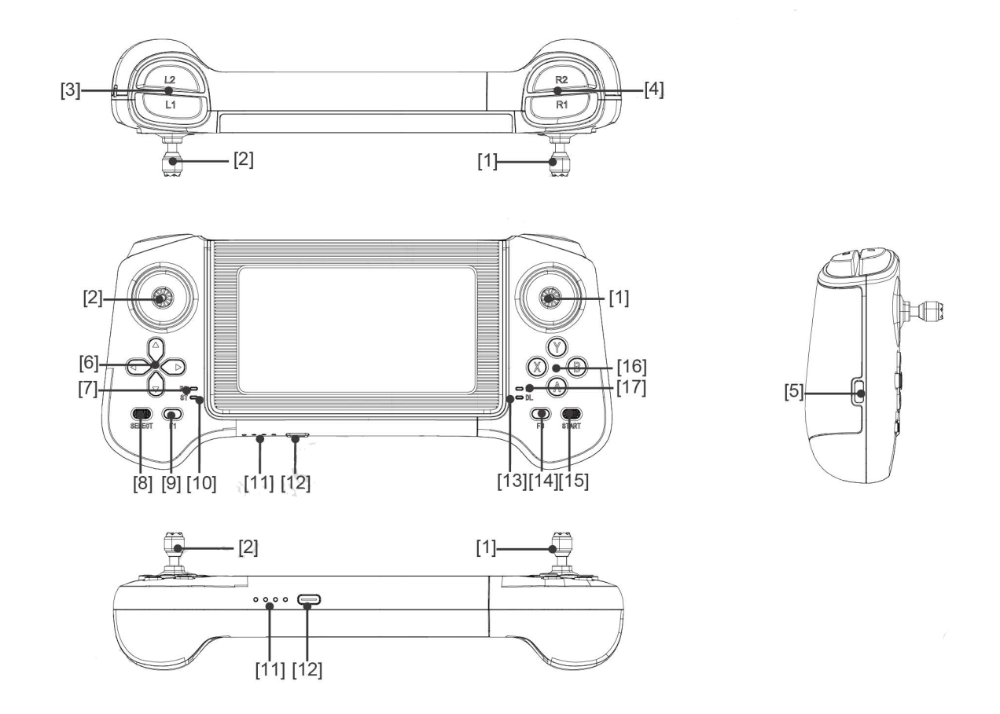

#### Technical Specifications

| Parameter            | Specification                 |
| -------------------- | ----------------------------- |
| Charging Voltage     | 5.0V                          |
| Charging Current     | 700mA                         |
| Battery Capacity     | 780mAh Lithium Battery        |
| Communication Mode   | Data Transmission, Bluetooth  |
| Running Time         | 5 hours                       |
| Remote Control Range | Above 100m (open environment) |

### Installation and Calibration

#### Installing the Joystick

1. **Remove the joystick**:
   - Pull out the remote control from the storage slot.
   - Remove the two joysticks.

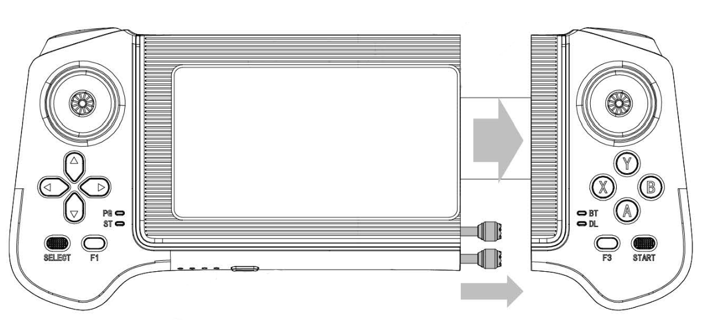

2. **Install the joystick**:
   - Secure each joystick by rotating it clockwise until tight.

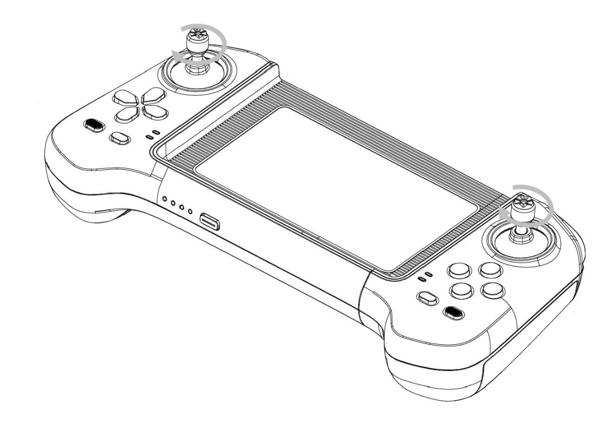

#### Rocker Calibration

1. Hold the remote control without touching the rocker.
2. Press `F1` and `F3` simultaneously to enter **calibration mode**.
   - The remote will emit a continuous "beep-beep" sound (1 beep/second).
3. Rotate the left and right rockers to full rudder several times.
4. When the beeping stops, press `F3` once to save the calibration.

> **Attention**
> - Do not touch the rockers before entering calibration mode.
> - Move the rockers **only** after calibration mode is active.

### Powering On/Off

#### Turning On

1. Short-press the power button once.
2. Long-press the power button for **2+ seconds** until you hear two "beeps."

#### Turning Off

1. Short-press the power button once.
2. Long-press the power button for **2+ seconds** until you hear three "beeps."

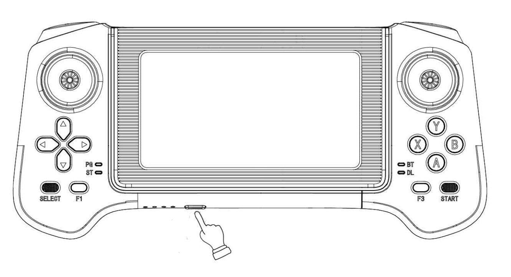

> **Tip**
> The sequence is **short press + long press for 2 seconds or more** for both turning on and off.

### Vibration and Sound Settings

#### Vibration/Sound Toggle

- **Switching vibration**: Quickly press `F3` **3 times** to switch to vibration mode.
- **Switch sound**: Quickly press `F3` **3 times** to switch to sound mode.

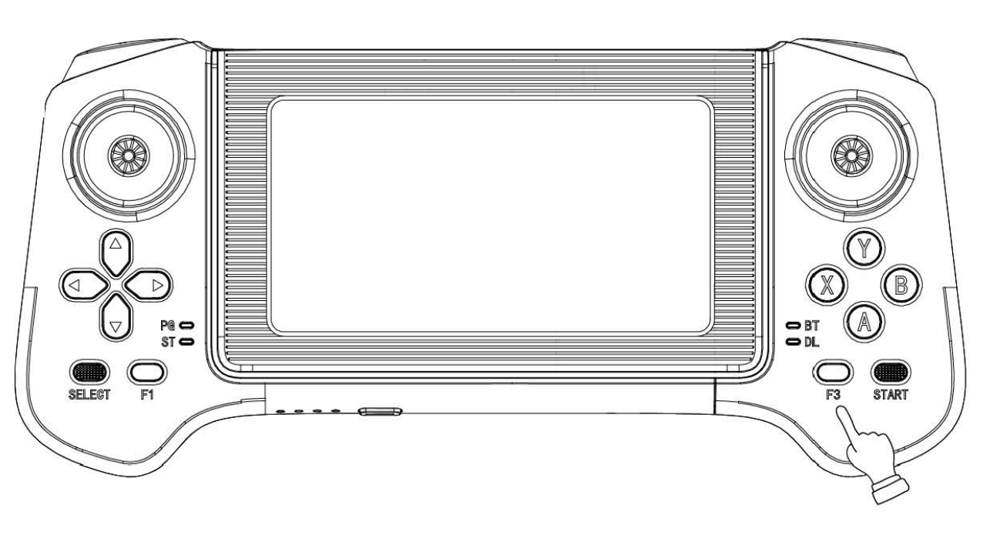

#### Vibration/Sound Switch

- **Turn off vibration/sound**: Quickly press `F1` **3 times** to turn off vibration/sound.
- **Turn on vibration/sound**: Quickly press `F1` **3 times** turn on vibration/sound.

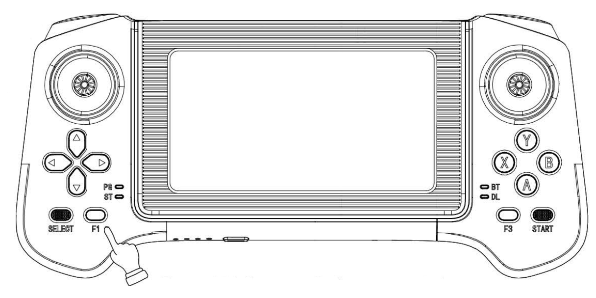

#### Save Feedback Settings

- To save vibration/sound settings for the next startup:
  - Hold down the `F1` button during shutdown.

> **Attention**
> By default, feedback settings (vibration/sound) are **not saved** after modifying.

> **Important**
> Always ensure to follow the correct steps to avoid damaging the remote control or affecting calibration accuracy.

---

## Remote Control Binding

### First-Time Use: Binding the Remote Control

To use the remote control for the first time:

1. Open the **Unitree Explore App** and Select "Device".
2. Go to the "Data" Section.
3. Select "RemoteControl Binding"
4. Tap "Change" and enter the corresponding remote control code.

| 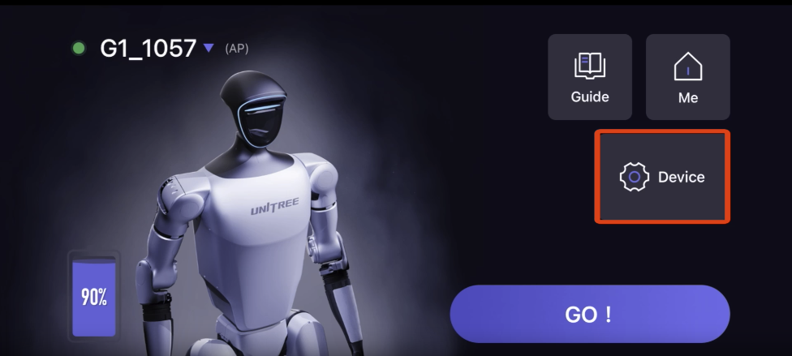 | 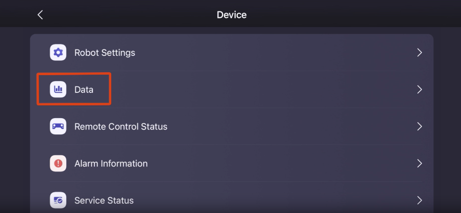 |
| :----------------------------------------------------: | :-------------------------------------------------------: |
|                **Navigate to "Device"**                |                 **Access the "Data" Tab**                 |

| 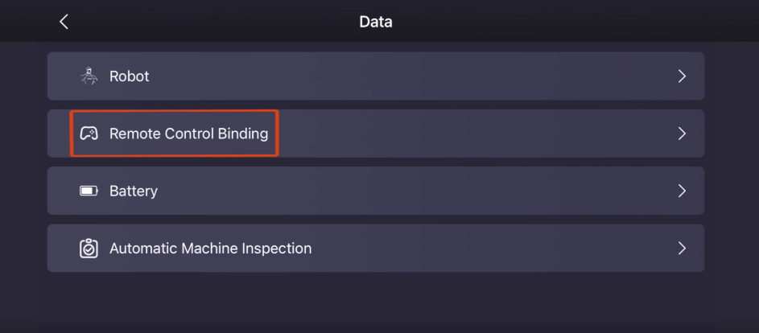 | 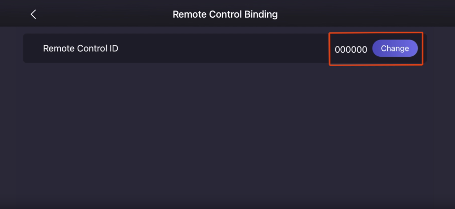 |
| :--------------------------------------------------------------: | :-------------------------------------------------: |
|                 **Open "RemoteControl Binding"**                 |                 **Select "Change"**                 |

Once the remote control is bound to the digital transmission module on the robot, it can connect automatically in subsequent uses.

#### Verifying Connection

- When the remote control is powered on and successfully connected to G1, the **right DL indicator light** will turn on.
- This indicates the remote control is linked to the G1 digital transmission module, and you can now operate G1 using the remote control.

---

## Remote Control Basic Operation

When using the remote control to maneuver the G1 robot with joysticks, follow these control methods:

**Left Joystick**

- **Push Forward:**

| 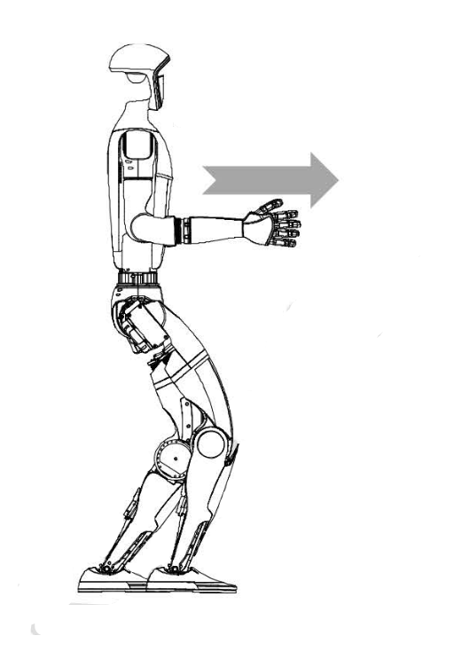 |  |
| :-------------------------------: | :------------------------------------: |

- **Push Backward:**

|  |  |
| :-------------------------------------------------------------------------------: | :-------------------------------------: |

**Right Joystick**

- **Right Turn:**
  - Push Joystick towards Right

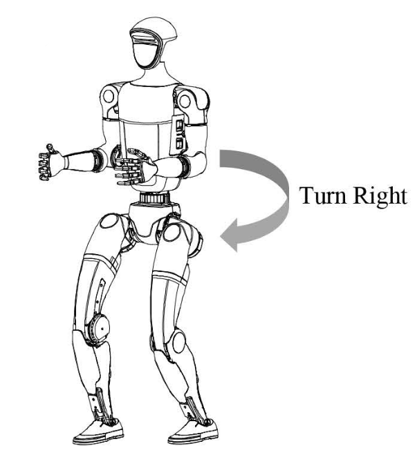

- **Left Turn:**
  - Push Joystick towards Left

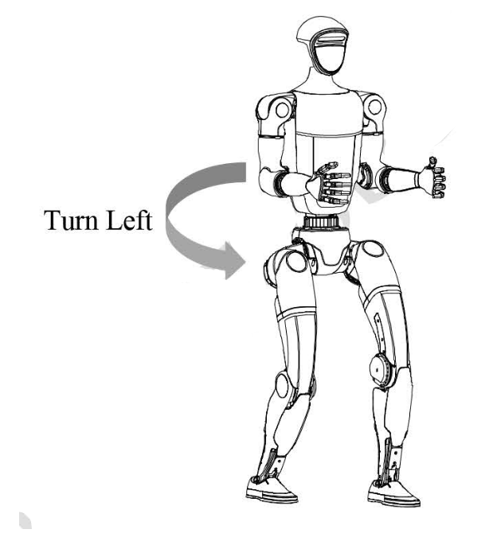

---

## Concept Descriptions

The G1 robot features several operational modes. Below is a detailed explanation of each mode:

| Mode                        | Description                                                                           |
| --------------------------- | ------------------------------------------------------------------------------------- |
| **Zero Torque Mode**        | All motors stop active motion; no damping is felt when the robot is moved manually.   |
| **Damping Mode**            | Motors stop active motion but provide resistance, allowing transition to ready mode.  |
| **Ready Mode**              | The robot assumes a preparatory posture for motion within 5 seconds.                  |
| **Squat Mode**              | The robot slowly transitions to a squat position (no balance control).                |
| **Seating Mode**            | The robot assumes a seated position (no balance control).                             |
| **Motion Mode**             | Enables motion control via the remote control.                                        |
| **Continuous Walking Mode** | The robot continuously steps without stopping.                                        |
| **Standing Mode**           | Robot maintains balance; it steps if the joystick is engaged or balance is disturbed. |
| **Debug Mode**              | Used for SDK development. Motion control is paused to prevent command conflicts.      |

> **Important**
> The current walking mode of the G1 robot does not support stair climbing. Avoid attempting to climb stairs to prevent damage.

---

## Mode Switching

The robot allows seamless transitions between modes using specific commands:

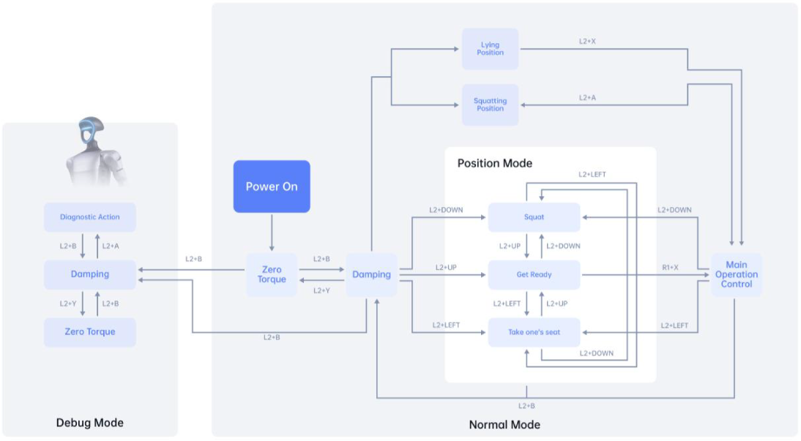

> **Important**
> - To switch back to Main Operation Control mode after using the squatting position (L2 + A), follow these steps:
>   1. Enter damping mode using **L2 + B**.
>   2. Switch to Main Operation Control mode using **L2 + A**.

---

## Key Descriptions

### Posture Modes

Use the following button combinations to switch between various posture modes:

| **Mode**           | **Button Combination**   | **Description**                               |
| ------------------ | ------------------------ | --------------------------------------------- |
| Debug Mode         | Hold L2 + Click R2       | Enter debug mode for testing and development. |
| Zero Torque Mode   | Hold L2 + Click Y        | Switch to zero torque mode.                   |
| Damping Mode       | [1] Hold L2 + Click B    | Activate damping mode for smooth motion.      |
| Lock Stand         | [2] Hold L2 + Click UP   | Lock the robot in a standing posture.         |
| Seated Mode        | [4] Hold L2 + Click LEFT | Switch to seated posture.                     |
| Lying and Standing | [5] Hold L2 + Click X    | Switch between lying and standing positions.  |
| Squat Switch       | [6] Hold L2 + Click A    | Alternate between squatting postures.         |

### Interactive Functions

The G1 robot supports various interactive gestures. Use the table below for guidance:

| **Gesture**               | **Button Combination** | **Description**                     |
| ------------------------- | ---------------------- | ----------------------------------- |
| Wave Hand                 | Hold SELECT + Click Y  | Robot waves its hand.               |
| Handshake                 | Hold SELECT + Click A  | Robot performs a handshake gesture. |
| Turn Around and Wave Hand | Hold SELECT + Click X  | Robot turns and waves at the user.  |

|  |  |
| :----------------------------------------: | :------------------------------------------------------------: |
|              **G1 Handshake**              |                **G1 Turn Around And Wave Hand**                |

| 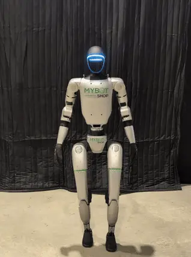 | 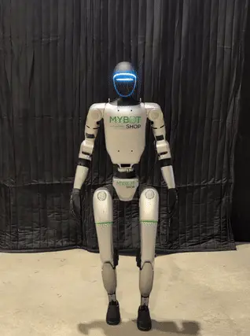 |
| :---------------------------------------------------: | :-------------------------------------------------: |
|                **G1 Wave Hand Right**                 |                **G1 Wave Hand Left**                |

| **[3] R2 + A(Run Control)** | **Button Combination** |
| --------------------------- | ---------------------- |
| Slow Running                | R2 + Down              |
| Fast Running                | R2 + Up                |
| Forward Lean                | Hold Start + Hold Up   |
| Backward Lean               | Hold Start + Hold Down |

| **[7] R1 + X (Main Operation Control)** | **Button Combination**                                                                                                                         |
| --------------------------------------- | ---------------------------------------------------------------------------------------------------------------------------------------------- |
| Keep stepping (not recommended)         | Double Click START                                                                                                                             |
| Standing                                | Click START                                                                                                                                    |
| Low speed mode                          | Double-Click L2                                                                                                                                |
| High speed mode                         | Double-Click L1                                                                                                                                |
| Offset Compensation                     | Left Offset:Hold R1 + Click - → Right Offset: Hold R1 + Click - ← Forward Offset: Hold R1 + Click ↓ Backward Offset Hold R1 + Click ↑ |

|  |  |
| :---------------------------------------------: | :----------------------------------------------: |
|              **G1 Low Speed Mode**              |              **G1 High Speed Mode**              |

| **[8] R1 + Y (Only Used For 3-DOF Waist Structure)** | **Button Combination**                                                                                                                         |
| ---------------------------------------------------- | ---------------------------------------------------------------------------------------------------------------------------------------------- |
| Keep stepping (not recommended)                      | Double Click START                                                                                                                             |
| Standing                                             | Click START                                                                                                                                    |
| Low speed mode                                       | Double-Click L2                                                                                                                                |
| High speed mode                                      | Double-Click L1                                                                                                                                |
| Offset Compensation                                  | Left Offset:Hold R1 + Click - → Right Offset: Hold R1 + Click - ← Forward Offset: Hold R1 + Click ↓ Backward Offset Hold R1 + Click ↑ |

> **Important**
> - Starting in lying or squatting positions is **only suitable for flat and hard ground**. Using these modes on uneven surfaces may lead to instability and potential damage.
> - If equipped with dexterous hand equipment, **avoid starting in lying or squatting positions** to prevent damage to delicate components.

---

## Boot Processes

**Regular Boot Process**

1. Boot -> **[1]** -> **[2]** -> **[3]** -> Demo -> **[4]** (Chair Seat) -> Turn off.

**Lying Boot Process**

1. Ensure the boot device crotch is flat against the ground.
2. Boot -> **[1]** -> **[5]** -> Demo -> **[6]** -> Turn off.

**Squatting Boot Process**

1. Start in a squatting posture.
2. Boot -> **[1]** -> **[6]** -> Demo -> **[6]** -> Turn off.

**3-DOF Waist structure**

- [7],[8] Only Used For 3-DOF Waist structure, recommended to use R1 + Y mode

**Remote Control Timeout**

- If the R3 remote control is not connected to the robot or phone after turning on, the robot will automatically shut down within 10 minutes of inactivity. To reconnect, power the robot on again.

---
[← G1 Operation (Firmware V1.0.2)](operation-1.2.md)

[Volver al Índice Principal](00_Readme.md)

[ROS2 Drivers →](ros2-drivers.md)