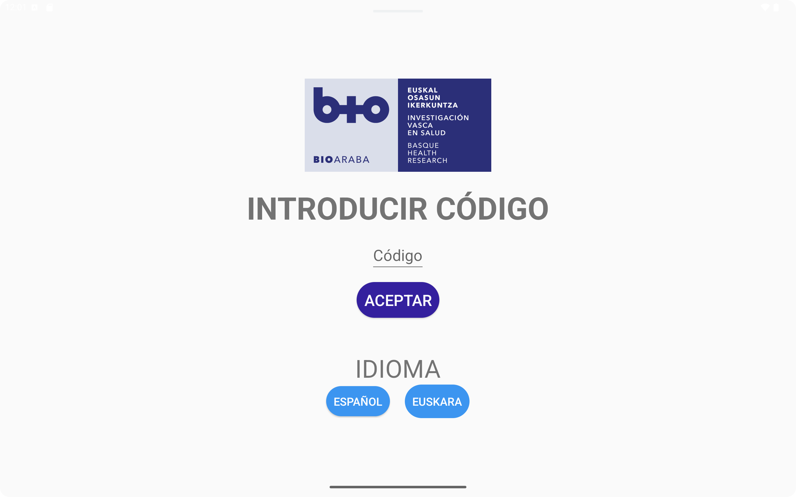
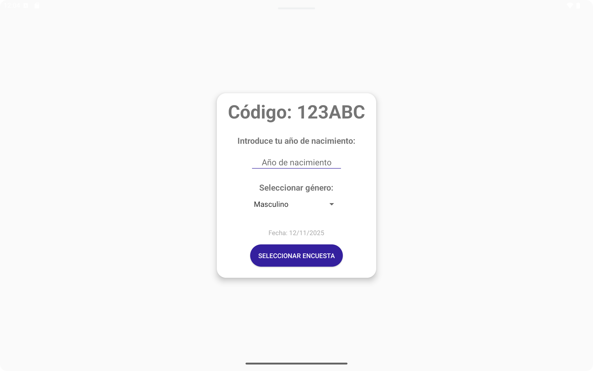
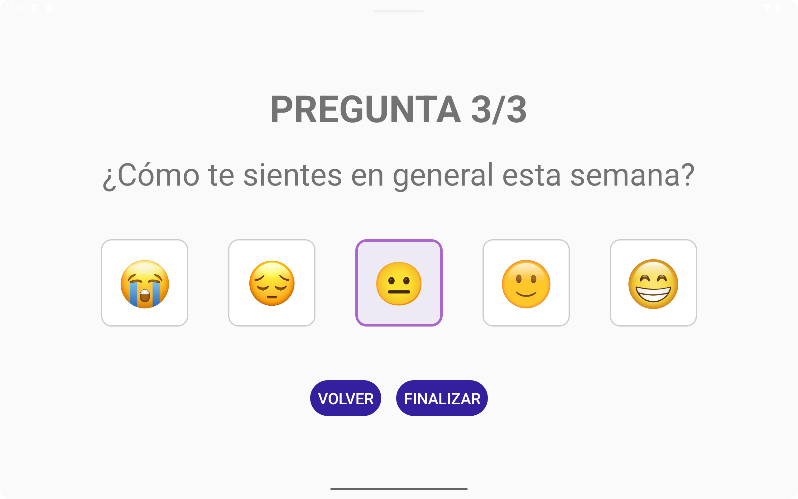
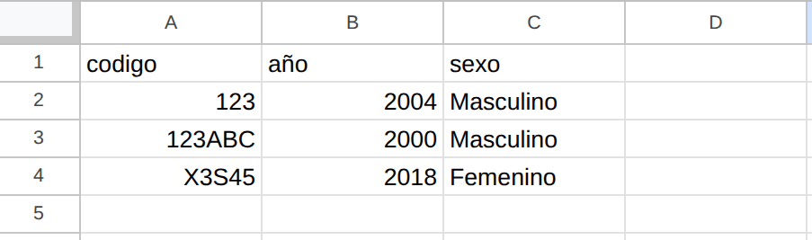
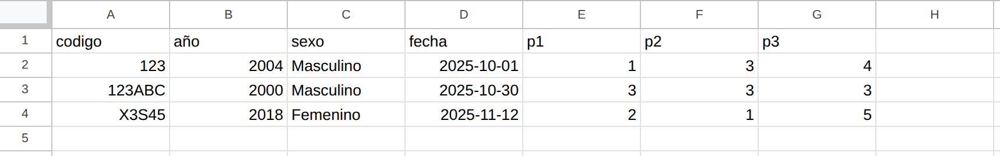
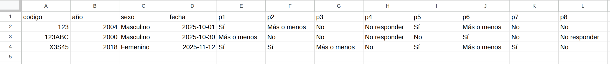

# 🧩 Guide to Reproducing the Survey APP on Other Devices

This document describes **how to reproduce the survey APP** on another machine. The app will be used in Spanish and Basque, so it is developed in those languages.

- [🔗 saaki-app-encuestas - Github](https://github.com/UAI-BIOARABA/saaki-app-encuestas)

---

## 🧠 Prerequisites

Make sure you have Android Studio installed on your system according to the guide provided in:

[AndroidStudio__Instalacion.md](AndroidStudio__Instalacion.md)

---

## ♻️ Reproducing the environment on another machine

1. Install base dependencies:

```bash
sudo apt update && sudo apt install openjdk-17-jdk git qemu-kvm libvirt-daemon-system libvirt-clients bridge-utils virt-manager -y
```

2. Install Android Studio:

```bash
snap install android-studio --classic
```

3. Clone the project:

```bash
git clone https://github.com/UAI-BIOARABA/EncuestasSaaki.git
```

4. Open the project in Android Studio.

5. Android Studio will automatically download the SDK and the required Gradle libraries.

6. **(Only for physical devices)** If you need a specific SDK for a device, go to:

```
Tools → SDK Manager
```

Then search for the SDK corresponding to the Android version of the device.

Example: In our case, we use a tablet with **Android 6.0**, so we need to download **SDK 23 for Android 6.0 (Marshmallow)**.

---

## ✅ Final verification

To check that everything works correctly:

1. Open the project.
2. Wait for Gradle synchronization to finish.
3. Click:

```
Android Studio
Build → Clean Project
```

Then click:

```
Android Studio
Build → Assemble 'app' Run Configuration
```

4. Open the emulator or connect a physical device.
5. Press **Run ▶️** in Android Studio.

If the app runs correctly: the environment has been successfully reproduced! 🎉

---

## 🧩 Export IDE configuration (optional)

From Android Studio:

```
File → Manage IDE Settings → Export Settings...
```

This generates a `.zip` file that can be imported on another machine using:

```
File → Manage IDE Settings → Import Settings...
```

---

## 📸 Some APP screenshots

#### Home



#### Data entry



#### Survey selection


#### Survey A




#### Summary A


#### Survey B


#### Summary B


---

## 💾 How data is stored

For reasons such as **ease of reading and editing, simplicity in storage or export, and response analysis**, this app stores user data and survey responses in **CSV format**.

To save the files we use:

```kotlin
val file = File(requireContext().getExternalFilesDir(null), "usuarios.csv")
```

The files are stored in the app's **external private storage**, at the following path:

```files
/storage/emulated/0/Android/data/com.example.encuestassaaki/files/
```

Inside this folder you will find the following files:

```files
usuarios.csv
encuesta_a.csv
encuesta_b.csv
us.bak (users backup)
ea.bak (encuestas_a backup)
eb.bak (encuestas_b backup)
```

Since our device uses **Android 6.0**, we can access these files directly from the tablet's file explorer. This greatly simplifies data access and avoids the need to implement additional export functionality.

---

## 💾 How the stored data looks

The data is stored in the CSV files as follows:

### Users



### Survey_A



### Survey_B



---

### 🚨 We do NOT store emojis — we store numbers on a scale from 1 to 5 🚨

### 🚨 Data is stored in Spanish regardless of the selected language 🚨