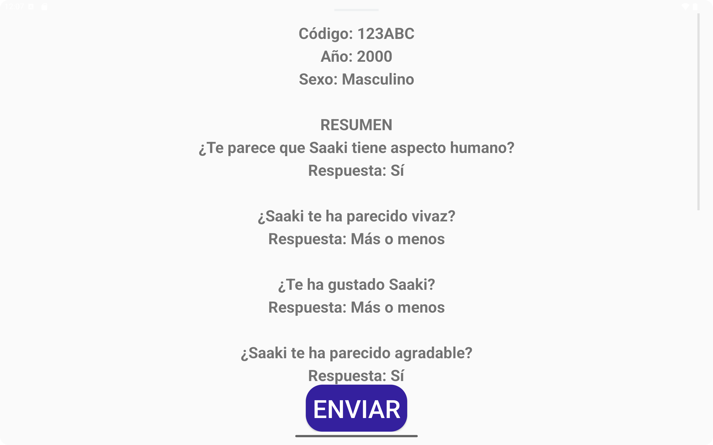
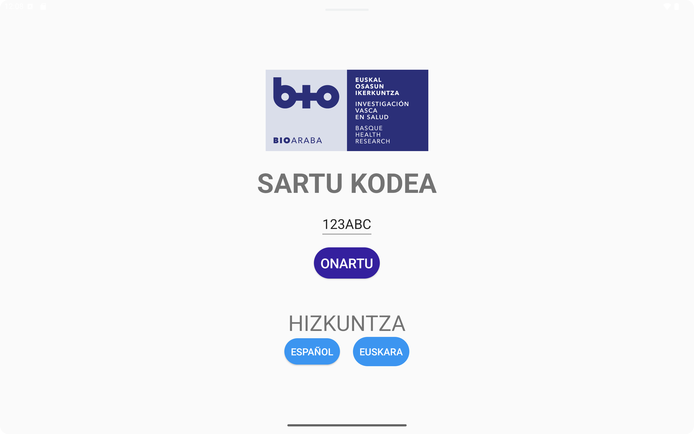
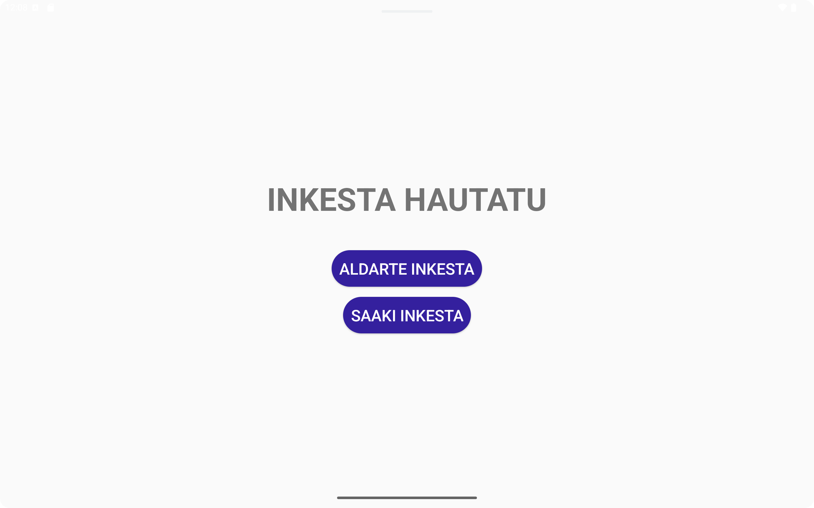
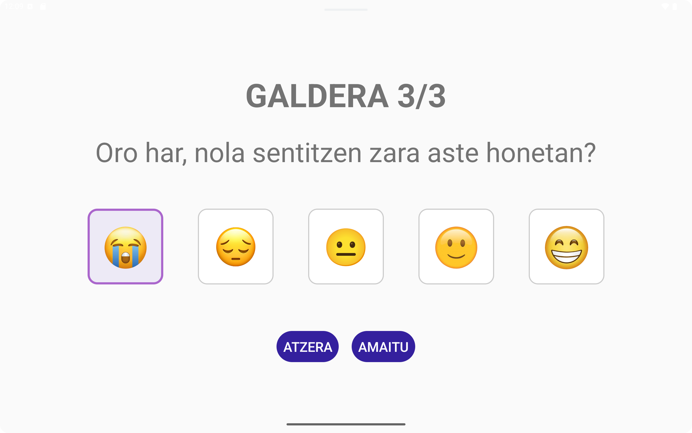
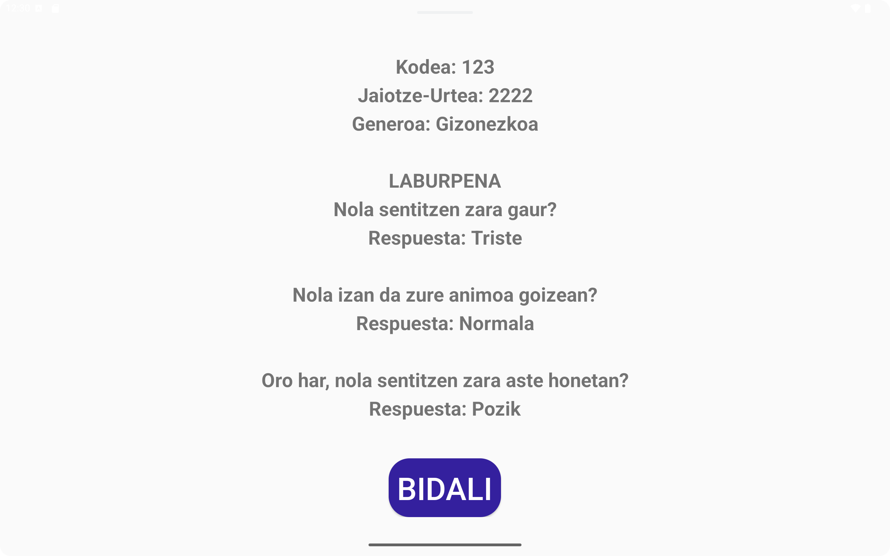
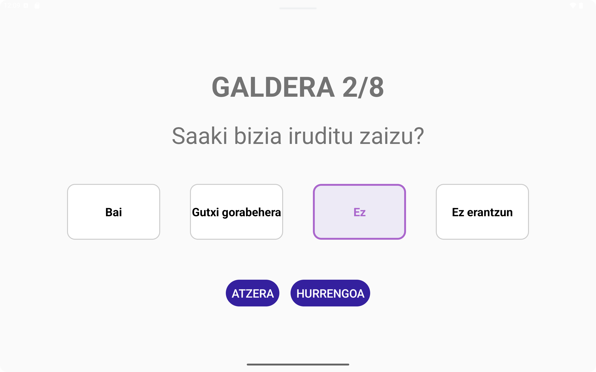
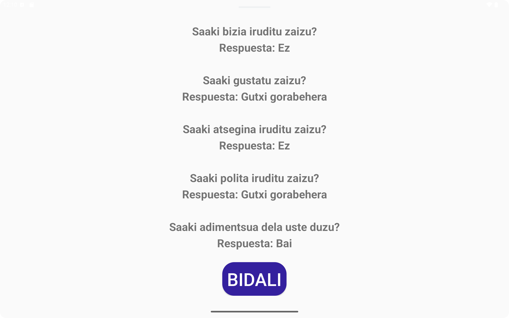

# 🧩 Guía de reproducción de la APP de Encuestas en otros dispositivos

Este documento describe **cómo reproducir la APP de encuestas** en otro equipo.

## 🧠 Requisitos previos

Asegúrate de tener instalado Android Studio en tu sistema conforme a la guía proporcionada en [AndroidStudio__Instalacion.md](AndroidStudio__Instalacion.md)

---

## ♻️ Reproducir el entorno en otro equipo

1. Instalar dependencias base:
   ```bash
   sudo apt update && sudo apt install openjdk-17-jdk git qemu-kvm libvirt-daemon-system libvirt-clients bridge-utils virt-manager -y
   ```
2. Instalar Android Studio (`snap install android-studio --classic`)
3. Clonar el proyecto:
   ```bash
   git clone https://github.com/andoni92/EncuestasSaaki.git
   ```
4. Abrir el proyecto en Android Studio
5. Android Studio descargará automáticamente el SDK y las librerías Gradle necesarias
6. (Solo para dispositivos físicos) En caso de necesitar un SDK específico para un dispositivo, ir a 'Tools → SDK Manager' y ahí buscar el SDK para la versión de Android del dispositivo. Como ejemplo, en nuestro caso, disponemos de una tablet con Android 6.0, por lo que necesitamos descargar el SDK 23 para Android 6.0 (Marshmallow).

---

## ✅ Verificación final

Para comprobar que todo funciona:
1. Abre el proyecto
2. Espera la sincronización de Gradle
3. Click en:
   ```
   Build → Clean Project
   ```
   Después click en:
   ```
   Build → Assemble 'app' Run Configuration
   ```
4. Abre el emulador o conecta un dispositivo físico
5. Pulsa **Run ▶️** en Android Studio

Si la app se ejecuta correctamente: ¡el entorno se ha reproducido con éxito! 🎉

---

## 🧩 Exportar configuración del IDE (opcional)

Desde Android Studio:
```
File → Manage IDE Settings → Export Settings...
```

Esto genera un `.zip` que puedes importar en otro equipo con:
```
File → Manage IDE Settings → Import Settings...
```

---

## 📸 Imagenes de la APP

### 🟥🟨🟥 CASTELLANO 

#### Inicio


#### Introducción de datos


#### Selección de encuesta


#### Encuesta A


#### Resumen A


#### Encuesta B


#### Resumen B


###  ⬜🟩🟥 EUSKARA 

#### Hasiera


#### Datuak sartzea


#### Inkestaren hautaketa


#### Inkesta A




#### Laburpena A


#### Inkesta B




#### Laburpena B


---